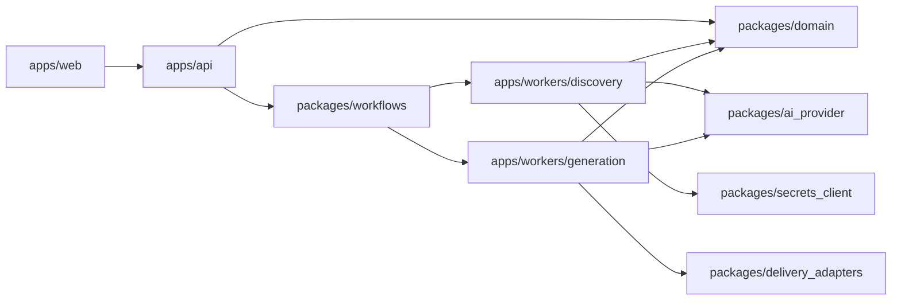
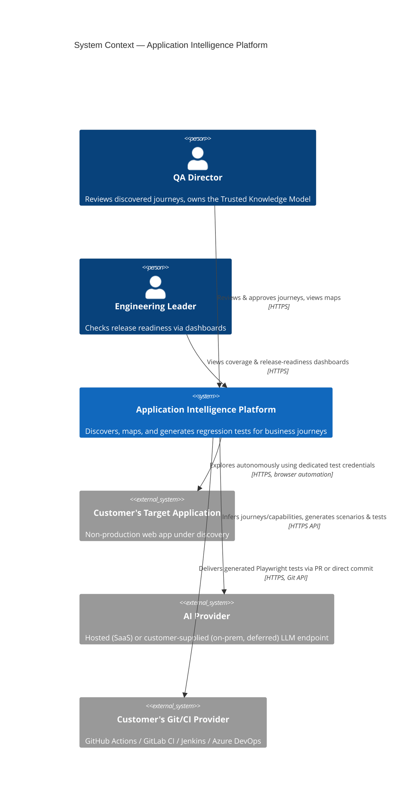
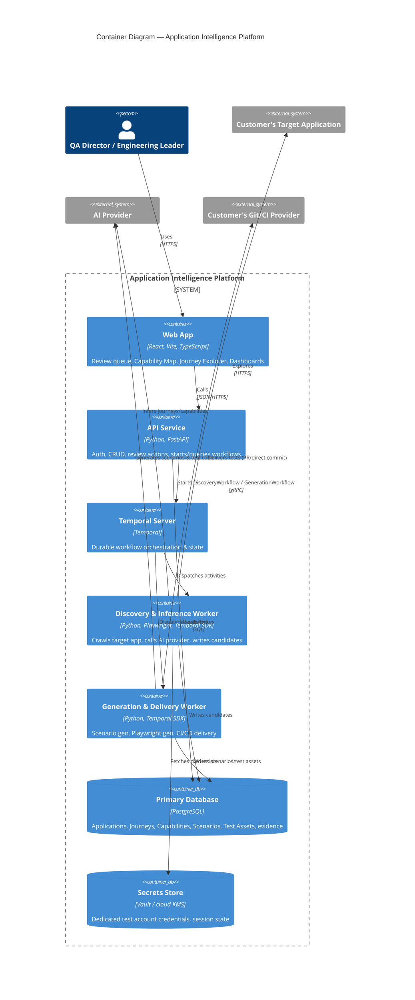
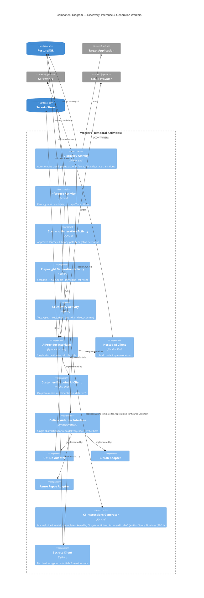
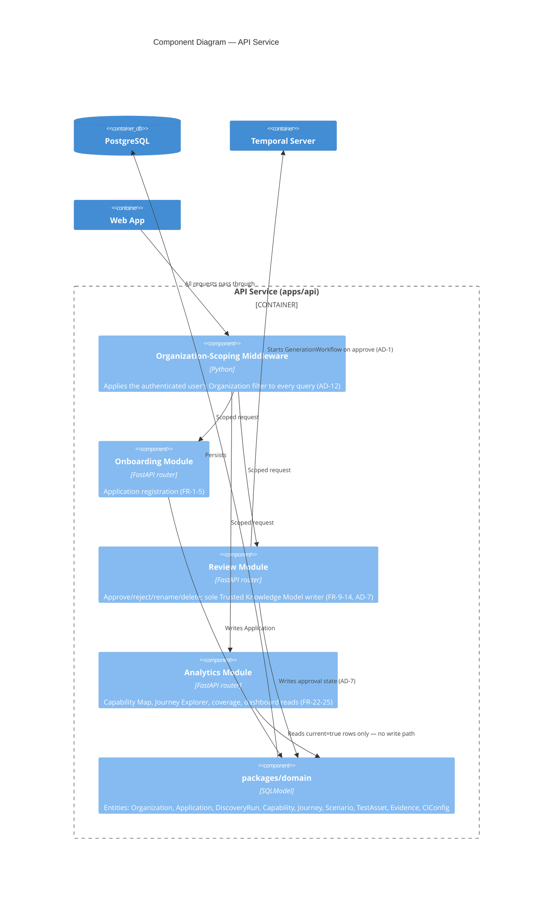
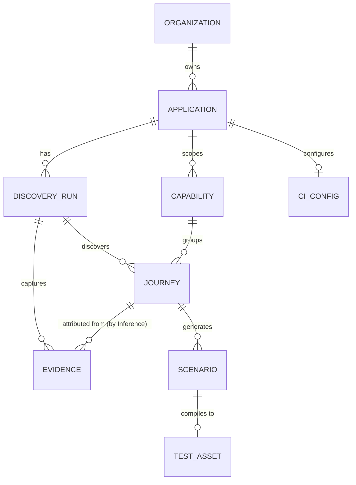

# Architecture Spine — Application Intelligence Platform

## Design Paradigm

**Durable Orchestrated Pipeline with Ports & Adapters at the boundaries.** The product's core mechanic — discover → infer → *human gate* → generate → deliver — is a multi-stage pipeline where stages are long-running, retriable, and independently ownable. Temporal Workflows carry the pipeline's coordination; Temporal Activities are the only place side effects (browser automation, LLM calls, DB writes, Git operations) happen. Everything the platform doesn't control — the AI provider, the customer's Git/CI provider, the secrets store — sits behind a named interface (a "port"), with swappable implementations ("adapters"). This is what lets V2/V3 add new AI-heavy capability, and later on-prem deployment, without destabilizing V1's boundaries.

Layer → namespace map:

| Layer | Namespace | Role |
| --- | --- | --- |
| Presentation | `apps/web` | Renders state; performs no business logic |
| Command/Query surface | `apps/api` | Owns the Trusted Knowledge Model's writes; starts/queries workflows |
| Orchestration | `packages/workflows` | Coordination only — no I/O (AD-2) |
| Execution | `apps/workers/*` | All I/O-performing Activities |
| Ports | `packages/ai_provider`, `packages/delivery_adapters`, `packages/ci_instructions`, `packages/secrets_client` | Interfaces insulating the domain from vendors |
| Domain | `packages/domain` | Entities and their invariants, shared by API and workers |

## Invariants & Rules



### AD-1 — Bounded discovery workflow; review lives in the database, not a paused workflow

- **Binds:** FR-6, FR-7, FR-8, FR-9, FR-14, FR-15
- **Prevents:** Modeling unbounded human-review latency (hours to weeks) inside a workflow's execution history, and the resulting ambiguity over which system — Temporal or Postgres — is the source of truth for review state.
- **Rule:** `DiscoveryWorkflow` is bounded: it runs Discovery + Inference and terminates by writing candidate Journeys/Capabilities to Postgres with `status=candidate`. Human review (approve/reject/rename/delete) is ordinary CRUD through `apps/api` against Postgres — never a Temporal Signal/Update on a long-lived workflow. Each individual approval starts a new, independent, short-lived `GenerationWorkflow`, whose Temporal workflow ID is `generation-{journey_id}-{attempt}`, where `attempt` is a counter `apps/api` increments transactionally in the same write that sets `status=approved` (see AD-9) — this makes a double-click approval a no-op (Temporal rejects the duplicate ID) while still letting FR-18's full regeneration start a fresh attempt against the same Journey.

### AD-2 — Workflows orchestrate only; Activities own all I/O

- **Binds:** `packages/workflows`, `apps/workers/*`
- **Prevents:** Non-deterministic workflow code (a direct DB call, HTTP call, or `datetime.now()` inside a Workflow breaks Temporal's replay guarantee) and, more broadly, two workers independently deciding where a side effect belongs.
- **Rule:** Code under `packages/workflows` contains no network calls, no DB access, and no direct browser/LLM/Git calls — only calls to Activities and Workflow-safe primitives (timers, signals). All I/O lives in `apps/workers/*` Activities.

### AD-3 — AI calls go through one `AIProvider` port

- **Binds:** FR-8, FR-16, FR-17, FR-27
- **Prevents:** Vendor SDK calls scattered across Inference/Scenario/Playwright-generation Activities, which would make the hosted-vs-customer-supplied-endpoint split (FR-27) a rewrite instead of a config change when on-prem is built.
- **Rule:** No Activity imports an AI vendor SDK directly. All inference/generation calls go through `packages/ai_provider`'s `AIProvider` interface; only that package's implementations may hold vendor-specific code.

### AD-4 — CI/CD delivery goes through one `DeliveryAdapter` port, keyed by Git host — not by CI system

- **Binds:** FR-19, FR-20, FR-21
- **Prevents:** Provider-identity branching (`if provider == "github"`) leaking into `CIDeliveryActivity` or generation logic; and, specifically, treating "GitHub Actions / GitLab CI / Jenkins / Azure DevOps" as four symmetric repo-delivery targets when Jenkins is a CI runner with no native Git-hosting/PR API of its own — a Jenkins customer's source still lives on GitHub, GitLab, or another host, and that host is what actually receives the PR or commit.
- **Rule:** `CIDeliveryActivity` calls only the `DeliveryAdapter` interface in `packages/delivery_adapters`, selected by the Application's configured **Git host** (GitHub, GitLab, or Azure Repos) — never by its CI system. FR-21's manual pipeline-wiring instructions are a separate concern, owned by `packages/ci_instructions` (see Structural Seed), keyed by the Application's configured **CI system** (GitHub Actions, GitLab CI, Jenkins, or Azure Pipelines) independently of which host it delivers to — so a Jenkins-on-GitHub customer gets the GitHub `DeliveryAdapter` plus Jenkins-flavored wiring instructions, not a "Jenkins adapter" that doesn't correspond to anything real.

### AD-5 — Discovery credentials never touch primary storage in plaintext

- **Binds:** FR-2, FR-3
- **Prevents:** A Dedicated Test Account credential or SSO/MFA session state landing in a Postgres column or an application log in recoverable form.
- **Rule:** Credentials and session state are written and read only through `packages/secrets_client`, backed by a dedicated secrets store (Vault or cloud KMS-backed envelope encryption). `packages/domain` models store a secret *reference*, never a secret value.

### AD-6 — The API's generated OpenAPI spec is the only contract between frontend and backend

- **Binds:** `apps/web`, `apps/api`
- **Prevents:** Frontend (TypeScript) and backend (Python) type definitions for the same entity drifting apart — a real risk now that they're two languages with no shared compiler.
- **Rule:** `apps/web`'s API types are generated from `apps/api`'s FastAPI/Pydantic-derived OpenAPI spec. No hand-written duplicate of a request/response shape is permitted in `apps/web`.

### AD-7 — Trusted Knowledge Model has one writer path

- **Binds:** FR-9, FR-10, FR-11, FR-12, FR-13, FR-14
- **Prevents:** A Journey or Capability being marked `approved`/`rejected` from anywhere other than the reviewer-facing endpoints — e.g., a worker "helpfully" auto-approving a high-confidence candidate, which would break the human-in-the-loop trust guarantee the product is sold on.
- **Rule:** Only `apps/api`'s review endpoints may transition a Journey/Capability's status to `approved` or `rejected`. Workers may only write `candidate` (Discovery/Inference), or downstream generation status (`generated`, `delivered`) — never an approval-state transition.

### AD-8 — Every inferred artifact keeps a live pointer back to its evidence, at the right granularity

- **Binds:** FR-8, FR-18, FR-23, FR-24
- **Prevents:** A Journey/Scenario/TestAsset existing in the database with no traceable path back to the discovery signal that produced it (breaking the "auditable, not black-box" trust mechanic in `DESIGN.md`); and, specifically, a run-level-only pointer that can't answer "which evidence supports *this* Journey" when one Discovery Run yields several Journeys, or "which generation attempt produced *this* Test Asset" when FR-18 regenerates from scratch.
- **Rule:**
  - `Evidence` rows (pages, actions, API calls) are captured during Discovery tagged with `discovery_run_id`. `InferenceActivity` — not `DiscoveryActivity` — is responsible for attributing each Evidence row it used to support a candidate Journey by setting that row's `journey_id`; a Journey's evidence trail (FR-23) is the set of `Evidence` rows where `journey_id` matches, not the whole run's signal.
  - `Journey.discovery_run_id` is set once, at creation, and is immutable — it identifies which Discovery Run *discovered* the Journey, independent of how many times it's later regenerated.
  - `Scenario` and `TestAsset` rows carry their own `generation_run_id` (the `GenerationWorkflow` attempt — AD-1 — that produced them) plus a `current: bool` flag. A new FR-18 regeneration attempt writes new `Scenario`/`TestAsset` rows with `current=true` and flips the prior attempt's rows to `current=false` (soft-superseded, retained for audit — never deleted). The Journey Explorer and coverage analytics (FR-24) only ever read `current=true` rows; "does this Journey have a Test Asset" is `EXISTS(... current=true)`.
  - `Evidence` rows store structured metadata (page URL, action type, API call signature, timestamp) in Postgres. Large binary artifacts (screenshots, full DOM snapshots) are never stored inline — `Evidence` holds an object-storage key/reference; the object-storage backend itself is deferred (Operational Envelope), but the split between structured-metadata-in-Postgres and blobs-in-object-storage is decided now.

### AD-9 — Side-effecting Activities must be idempotent under Temporal's at-least-once retry

- **Binds:** `apps/workers/discovery`, `apps/workers/generation`, `apps/api` (approve action)
- **Prevents:** A retried Activity re-doing an external side effect a customer can see — a duplicate PR, a form double-submitted against the target application — or the inverse: an approval recorded in Postgres with no `GenerationWorkflow` ever actually started because the process crashed between the two writes. Left unstated, one engineer implements "create PR" unconditionally and another defensively checks for an existing one first — both technically satisfy AD-4, and only one is correct.
- **Rule:** Every Activity that performs an external side effect (`DiscoveryActivity` submitting a form, `CIDeliveryActivity` creating a PR/commit) must check-before-acting using a deterministic key derived from its inputs (e.g., a PR branch name derived from `journey_id` + `attempt`), so a retry finds and reuses its own prior effect instead of repeating it. `apps/api`'s approve endpoint sets `status=approved` and starts the `GenerationWorkflow` (AD-1) in the same request; a startup reconciliation check sweeps for any `approved` Journey with no corresponding workflow and starts one, so a crash between the two writes self-heals rather than silently orphaning the approval.

### AD-10 — Discovery Run completeness is a first-class, queryable status

- **Binds:** FR-7, PRD §10 Reliability NFR
- **Prevents:** A Discovery Run that hit its time budget being indistinguishable from one that finished exhaustively — silently presenting a partial map as a finished one.
- **Rule:** `DiscoveryRun.status` is one of `running | complete | incomplete | failed`, set by `DiscoveryWorkflow`: `complete` on exhaustive-traversal termination, `incomplete` on time-budget cutoff (FR-7), `failed` on unrecoverable error (AD-11). `apps/api` and the UI's status pill read this field directly — completeness is never inferred from the presence/absence of other data.

### AD-11 — Session expiry is a named failure mode, not a silent partial result

- **Binds:** FR-3
- **Prevents:** A Discovery Run whose session expired mid-crawl producing a truncated map that looks like a normal (if small) result, instead of the graceful failure + re-authentication prompt FR-3 requires.
- **Rule:** `DiscoveryActivity` detects an auth-redirect (session expired) as a distinct condition from a normal stop condition (AD-10) and terminates the run with `DiscoveryRun.status=failed`, `failure_reason=session_expired`. `apps/api` surfaces a re-authentication prompt keyed specifically off that reason — distinguishable from both `incomplete` (time budget) and any other `failed` cause.

### AD-12 — Every Application belongs to exactly one Organization; every query is Organization-scoped

- **Binds:** FR-25, platform auth
- **Prevents:** Independently-built endpoints deciding "which Applications can this user see" differently — a data-leak risk across customer organizations once more than one exists, which FR-25's multi-application dashboard already assumes from V1 launch.
- **Rule:** `Organization` is a first-class entity. `Application` (and everything under it) belongs to exactly one `Organization`. `apps/api` scopes every query by the authenticated user's `Organization` through one central mechanism (e.g., a default query-layer filter), never left to individual endpoints to remember. This holds regardless of the deferred SaaS/on-prem topology question — even a single-tenant on-prem deployment has exactly one `Organization`.

### AD-13 — Journeys carry a stable identity key, separate from their AI-generated name, for re-discovery dedup

- **Binds:** FR-15
- **Prevents:** Two engineers implementing FR-15's "is this Journey new?" check against different notions of identity — one comparing AI-generated names (which can vary slightly run to run), another comparing something else — producing inconsistent, unreliable dedup.
- **Rule:** `InferenceActivity` computes a deterministic `identity_key` for each candidate Journey from its underlying page/action/API-call signature (evidence shape), not from its AI-generated display name. On re-discovery, a new candidate whose `identity_key` matches an existing Journey in the same Application is suppressed from the review queue (FR-15) and does not alter the existing Journey's `discovery_run_id` or evidence attribution (AD-8) — the original attribution is preserved, consistent with FR-15's "existence check," a materially smaller capability than change detection.

## Consistency Conventions

| Concern | Convention |
| --- | --- |
| Naming (entities, files, interfaces, events) | Domain models: singular PascalCase (`Application`, `DiscoveryRun`, `Capability`, `Journey`, `Scenario`, `TestAsset`, `Evidence`, `CIConfig`). DB tables: snake_case plural. API JSON: camelCase (FastAPI field aliasing). Temporal workflows: PascalCase + `Workflow` (`DiscoveryWorkflow`, `GenerationWorkflow`). Activities: PascalCase + `Activity`. Ports: PascalCase + `Provider`/`Adapter`/`Client` (`AIProvider`, `DeliveryAdapter`, `SecretsClient`). |
| Data & formats (ids, dates, error shapes, envelopes) | Internal primary keys: UUIDv7 (Postgres 18 native `uuidv7()`) for index locality. Any id exposed in an API response is a separate, opaque UUIDv4 — the UUIDv7 PK never leaves the backend, since its timestamp prefix would leak record-creation time. Dates: UTC, ISO 8601, stored as `timestamptz`. API errors: RFC 7807 `application/problem+json` envelope. |
| State & cross-cutting (mutation, errors, logging, config, auth) | Trusted Knowledge Model single-writer rule (AD-7). Workflows orchestrate only (AD-2). Evidence pointer required on every inferred row, at Journey vs. generation-attempt granularity (AD-8). Side-effecting Activities are idempotent under retry (AD-9). Every query is Organization-scoped (AD-12). Structured JSON logs, correlated by Temporal `workflow_id` across `apps/api` and `apps/workers/*`. Config via environment + secrets-store references only; no hardcoded vendor SDK call or deployment-mode branch outside the port packages (AD-3, AD-4). `packages/secrets_client`'s backing store (Vault vs. cloud KMS) is chosen at deploy time behind the same port — not a V1 blocker. Platform user auth (`apps/web` ↔ `apps/api`) is a distinct namespace from discovery target credentials (Dedicated Test Account) — never conflated. |

## Stack

| Name | Version |
| --- | --- |
| Python | 3.14.6 |
| FastAPI | current stable |
| SQLModel | current stable |
| Alembic | current stable |
| PostgreSQL | 18.4 |
| Temporal (Python SDK) | current GA |
| Playwright (Python) | 1.57+ |
| React | 19.x |
| Vite | 8.1.x (Vite 8, Mar 2026 — Rolldown/Oxc-based; full plugin compatibility per vite.dev) |
| TypeScript | 7.0 (GA July 8, 2026 — native Go compiler; verify AD-6's OpenAPI→TS codegen tooling supports it before adopting, else pin 5.9 as fallback) |

## Structural Seed

```text
apps/
  web/                      # React + Vite + TS SPA — review queue, Capability Map, Journey Explorer, dashboards
  api/                      # FastAPI service — auth, CRUD, review endpoints, starts/queries workflows
  workers/
    discovery/               # DiscoveryActivity (Playwright), InferenceActivity
    generation/               # ScenarioGenerationActivity, PlaywrightGenerationActivity, CIDeliveryActivity
packages/
  domain/                    # SQLModel entities: Organization, Application, DiscoveryRun, Capability, Journey, Scenario, TestAsset, Evidence, CIConfig
  workflows/                  # DiscoveryWorkflow, GenerationWorkflow — orchestration only (AD-2)
  ai_provider/                 # AIProvider interface + hosted/on-prem implementations (AD-3)
  delivery_adapters/            # DeliveryAdapter interface + GitHub/GitLab/Azure Repos adapters, keyed by Git host (AD-4)
  ci_instructions/               # Provider-specific manual pipeline-wiring templates: GitHub Actions/GitLab CI/Jenkins/Azure Pipelines (FR-21, AD-4)
  secrets_client/               # SecretsClient interface + Vault/KMS implementation (AD-5)
migrations/                  # Alembic migration scripts
```

### Operational Envelope

Decided now (doesn't depend on the deferred SaaS/on-prem topology choice): every `apps/*` service ships as its own container image; the platform's own CI (build/test/lint on this codebase, not to be confused with the customer-facing CI/CD delivery feature) runs on GitHub Actions; traces and metrics extend the existing logging convention — every span/metric is correlated by Temporal `workflow_id`, matching the log-correlation convention above, via OpenTelemetry.

Deferred (genuinely coupled to the SaaS/on-prem topology decision, not decidable in isolation): where Temporal itself runs (self-hosted cluster vs. Temporal Cloud), the object-storage backend for raw discovery-evidence blobs (see AD-8 note below), and the production infra/provider choice.

### System Context



### Containers



### Components — Workers



### Components — API Service

The same "one module, one job" rule applies inside `apps/api`. Onboarding, Review, and Analytics never call each other directly or share handler code — each talks only to `packages/domain`, and every one of them passes through the same Organization-scoping middleware (AD-12) rather than re-implementing tenant isolation.



### Module Contracts ("C4" — the interfaces this spine actually fixes)

No implementation exists yet, so a class diagram would be fiction. What *is* fixed, and genuinely worth a developer reading before writing a line of code, is the shape of each port and each module's Activity signature — because these are exactly what two independently-built modules must agree on byte-for-byte to stay loosely coupled. Everything not listed here (internal helper functions, private classes) is left to the implementer.

**Ports** (`packages/*`, AD-3/AD-4/AD-5):

```text
# packages/ai_provider
class AIProvider(Protocol):
    def infer_journeys(evidence: list[Evidence]) -> list[JourneyCandidate]: ...
    def generate_scenarios(journey: Journey, evidence: list[Evidence]) -> list[Scenario]: ...
    def generate_playwright(scenario: Scenario) -> TestAssetCode: ...
# Implementations: HostedAIProvider (SaaS), CustomerEndpointAIProvider (on-prem, deferred)

# packages/delivery_adapters
class DeliveryAdapter(Protocol):
    def deliver(test_asset: TestAsset, application: Application, mode: Literal["pr", "direct_commit"]) -> DeliveryResult: ...
# Implementations: GitHubAdapter, GitLabAdapter, AzureReposAdapter — keyed by Git host (AD-4), not CI system

# packages/ci_instructions
class CIInstructionsGenerator(Protocol):
    def render(ci_system: Literal["github_actions", "gitlab_ci", "jenkins", "azure_pipelines"]) -> InstructionsTemplate: ...

# packages/secrets_client
class SecretsClient(Protocol):
    def store(organization_id: UUID, secret: bytes) -> SecretRef: ...
    def resolve(ref: SecretRef) -> bytes: ...
# Implementations: VaultSecretsClient, CloudKMSSecretsClient — chosen at deploy time
```

**Module Activities** (input → output, per Module Map row above):

```text
DiscoveryActivity(application: Application, secret_ref: SecretRef) -> DiscoveryRun
InferenceActivity(discovery_run: DiscoveryRun, evidence: list[Evidence]) -> list[Journey]
ScenarioGenerationActivity(journey: Journey) -> list[Scenario]
PlaywrightGenerationActivity(scenario: Scenario) -> TestAsset
CIDeliveryActivity(test_asset: TestAsset, application: Application) -> DeliveryResult
```

Every Activity signature above takes and returns `packages/domain` types only — never a raw dict or a type private to one worker — which is what makes AD-9's idempotency contract and AD-2's "Workflows call Activities, not each other's internals" enforceable at a type-checker level, not just a code-review convention.

### Sequence — Discovery to Delivery

```mermaid
sequenceDiagram
    actor QA as QA Director
    participant SPA as Web App
    participant API as API Service
    participant TMP as Temporal
    participant DW as Discovery/Inference Worker
    participant DB as Postgres
    participant TGT as Target Application
    participant AI as AI Provider
    participant GW as Generation/Delivery Worker
    participant GIT as Customer Git/CI

    QA->>SPA: Configure Application (URL, creds, scope, time budget)
    SPA->>API: POST /applications
    API->>DB: Create Application record
    QA->>SPA: Start Discovery Run
    SPA->>API: POST /applications/{id}/discovery-runs
    API->>TMP: Start DiscoveryWorkflow
    TMP->>DW: Dispatch DiscoveryActivity
    DW->>TGT: Explore (pages, actions, forms, APIs)
    alt session expired mid-crawl
        DW->>DB: DiscoveryRun.status=failed, reason=session_expired (AD-11)
        Note over DW: Workflow ends; API surfaces re-auth prompt
    else exhaustive traversal OR time budget reached (FR-7)
        DW->>DB: Persist raw Evidence (tagged discovery_run_id only)
        DW->>DB: DiscoveryRun.status=complete or incomplete (AD-10)
        TMP->>DW: Dispatch InferenceActivity
        DW->>AI: Infer Journeys/Capabilities from Evidence
        AI-->>DW: Candidate Journeys/Capabilities (business language)
        DW->>DB: Write candidate Journeys (status=candidate, identity_key set — AD-13)
        DW->>DB: Attribute supporting Evidence rows to their Journey (journey_id — AD-8)
        Note over TMP: DiscoveryWorkflow completes (bounded — AD-1)
    end

    QA->>SPA: Open Review Queue
    SPA->>API: GET /review-queue
    API->>DB: Read candidates
    QA->>SPA: Approve Journey
    SPA->>API: POST /journeys/{id}/approve
    API->>DB: status=approved, increment attempt (Trusted Knowledge Model — AD-7)
    API->>TMP: Start GenerationWorkflow(id="generation-{journeyId}-{attempt}") — AD-1

    TMP->>GW: Dispatch ScenarioGenerationActivity
    GW->>AI: Generate happy-path + negative scenarios
    AI-->>GW: Scenarios
    GW->>DB: Write Scenarios
    TMP->>GW: Dispatch PlaywrightGenerationActivity
    GW->>AI: Generate Playwright code from Scenario
    AI-->>GW: Playwright Test Asset
    GW->>DB: Write Test Asset
    TMP->>GW: Dispatch CIDeliveryActivity
    GW->>GIT: Create PR or direct commit (per Application's configured mode/provider)
    GIT-->>GW: Delivery confirmation
    GW->>DB: Mark Test Asset delivered

    QA->>SPA: Open Dashboard
    SPA->>API: GET /analytics
    API->>DB: Read coverage (Journey has Test Asset?)
```

### Core-Entity ERD



`ORGANIZATION` is the tenant boundary (AD-12) — every query in `apps/api` is scoped by it. `EVIDENCE` is captured against a `DISCOVERY_RUN` first and attributed to a `JOURNEY` second, by `InferenceActivity` (AD-8) — the two relationships above are sequential, not redundant.

## Module Map

Every PRD feature area is one loosely-coupled module: a single Activity, endpoint group, or port package with one job, talking to its neighbors only through the domain (Postgres) or a port interface — never by importing another module's internals. This is the enforceable version of "loosely coupled": each row's **Isolation** column is what AD-2/AD-3/AD-4/AD-9 actually buy — a change contained to one module without a ripple.

| Module | Responsibility | Enables | Inputs | Outputs (where to observe) | Depends on | Isolation — what a fix/enhancement touches |
| --- | --- | --- | --- | --- | --- | --- |
| **Onboarding**<br>`apps/api` Application router, `packages/secrets_client` | Register an Application; capture URL, env, credentials, scope, time budget | FR-1–5 | Form submission from `apps/web` | `Application` row (Postgres); secret reference in SecretsClient | `packages/domain`, `packages/secrets_client` (AD-5) | A new credential type or scope rule stays inside this module + its SecretsClient implementation |
| **Discovery**<br>`apps/workers/discovery` (`DiscoveryActivity`), `DiscoveryWorkflow` | Autonomously explore the target app within scope/budget; detect stop conditions | FR-6–7 | `Application` config + credentials (via SecretsClient) | `Evidence` rows + `DiscoveryRun.status` (Postgres) | Target Application (external), SecretsClient | A new crawl strategy or stop condition never touches Inference or Review — it only ever writes `Evidence` + `DiscoveryRun.status` |
| **Inference**<br>`apps/workers/discovery` (`InferenceActivity`) | Raw Evidence → candidate Journeys/Capabilities; attribute Evidence to a Journey; compute `identity_key` | FR-8, FR-15 | `Evidence` rows from Discovery | `Journey`/`Capability` rows (`status=candidate`), `Evidence.journey_id` | `AIProvider` port (AD-3) | Changing the inference prompt/model, or the `identity_key` fingerprint (AD-13), never touches Discovery's crawl code or Review's approval logic |
| **Review**<br>`apps/api` review endpoints, `packages/domain` | Human approve / reject / rename / delete; sole writer of the Trusted Knowledge Model | FR-9–14 | Candidate Journeys/Capabilities; reviewer action from `apps/web` | `status=approved/rejected`; starts `GenerationWorkflow` (AD-1) | `packages/domain` (AD-7) | A new review action is isolated to this module — Discovery, Inference, and Generation only ever read `status`, never assume how it got there |
| **Scenario Generation**<br>`apps/workers/generation` (`ScenarioGenerationActivity`) | Approved Journey → happy-path + negative Scenarios | FR-16 | Approved `Journey` + its Evidence | `Scenario` rows | `AIProvider` port | Swapping the scenario strategy never touches Playwright generation — they share a workflow, not code |
| **Playwright Generation**<br>`apps/workers/generation` (`PlaywrightGenerationActivity`) | Scenario → executable Playwright Test Asset; owns regeneration/versioning | FR-17–18 | `Scenario` rows | `TestAsset` rows (code + `current` flag, AD-8) | `AIProvider` port | Regeneration/versioning logic changes stay inside this module; Scenario Generation is untouched |
| **CI Delivery**<br>`apps/workers/generation` (`CIDeliveryActivity`), `packages/delivery_adapters` | Push a Test Asset into the customer's repo (PR or direct commit) | FR-19–20 | `TestAsset` + Application's configured Git host | PR/commit on the customer's Git host | `DeliveryAdapter` port (AD-4), AD-9 | Adding a 4th Git host is one new adapter file; nothing else in the system changes |
| **CI Instructions**<br>`packages/ci_instructions` | Produce the manual pipeline-wiring template for the Application's CI system | FR-21 | Application's configured CI system | Instructions/template surfaced in `apps/web` | none — pure function of CI system | Adding a Jenkins- or Azure-Pipelines-flavored template touches only this module, independent of which Git host is in play |
| **Analytics**<br>`apps/api` analytics endpoints, `apps/web` | Capability Map, Journey Explorer, coverage analytics, executive dashboard | FR-22–25 | `current=true` Journey/Capability/TestAsset rows, Organization scope | Read views only | `packages/domain` (read-only) | A new dashboard view can never corrupt Trusted Knowledge Model state — Analytics has no write path into `packages/domain` |
| **Tenancy**<br>`packages/domain` (`Organization`), `apps/api` scoping | Owns the Organization boundary every other module's queries run through | FR-25, platform auth | Authenticated user session | Query-layer filter applied platform-wide (AD-12) | none — foundational | A data-isolation bug is fixable in exactly one place — the central scoping mechanism — never in N separate endpoints |
| **Deployment topology** | SaaS/on-prem infra, Temporal hosting | FR-26–27 | — | — | `AIProvider` port keeps this addable later | Deferred — see Deferred section |

## Deferred

- **SaaS vs. on-prem deployment topology** (FR-26, FR-27): single deployable vs. divergent builds, infra/provider choice, and where Temporal itself runs (self-hosted vs. Temporal Cloud). Explicitly deferred at the user's request this run. AD-3's `AIProvider` port means the hosted/on-prem split doesn't require rework of Activities when this is designed — only a new port implementation. Note: the *tenant/organization data boundary* (AD-12) is decided regardless of this deferral — even a single-tenant on-prem deployment has exactly one `Organization`; what's deferred here is infra topology, not data ownership. **Revisit before on-prem design/GA work begins.**
- **Object-storage backend for raw evidence blobs** (screenshots, DOM snapshots): the split itself — structured metadata in Postgres, binary artifacts referenced by object-storage key — is decided (AD-8); the specific object-storage provider is coupled to the deployment-topology deferral above.
- **SSO/MFA session-state capture mechanism** (PRD Open Question 8): how a customer actually hands off a reusable session state is unresolved in the PRD itself. **Blocks** detailed design of the Onboarding flow's auth step (FR-3) — must resolve before that slice is built.
- **Direct-commit regeneration conflict handling** (PRD Open Question 6): what happens when `CIDeliveryActivity`'s direct-commit path overwrites a customer's manually-edited test file is undecided. AD-9's idempotency rule prevents *duplicate* commits on retry, but not this separate question of overwriting a human's manual edit — needs a product decision before that Activity's direct-commit branch is implemented.
- **Non-production technical safeguard** (PRD Open Question 3): currently customer-responsibility only (PRD §11); no platform-side guardrail is designed against `DiscoveryActivity` targeting a production environment.
- **Review-queue live-count delivery mechanism**: whether the nav rail's pending-count badge (`DESIGN.md`) is client-side refetch/decrement or a push channel (WebSocket/SSE) is an implementation choice within `apps/api`/`apps/web`, not an architectural boundary — no port or AD is needed either way, so it's left to implementation.
- **Confidence/risk scoring reintroduction path**: cut for V1 per PRD §5/addendum. Not designed against here; AD-8's evidence-pointer requirement leaves room for a future discovery-signal-only confidence score without restructuring the domain model.
- **Reviewer prioritization/importance-marking**: out of V1 scope per PRD §5; no architecture accommodation made.
- **Tenant billing/plan model**: AD-12 fixes the data-isolation boundary (every query is Organization-scoped); billing, plan tiers, and seat management are unaddressed and out of this spine's scope.
- **V2 source-code correlation / V3 change-impact prediction**: out of this spine's altitude entirely. AD-3's port boundary is the intentional seam — a future code-analysis/retrieval capability can be added as a new worker or service behind the existing `AIProvider`/`domain` boundaries rather than requiring a V1 rewrite.
