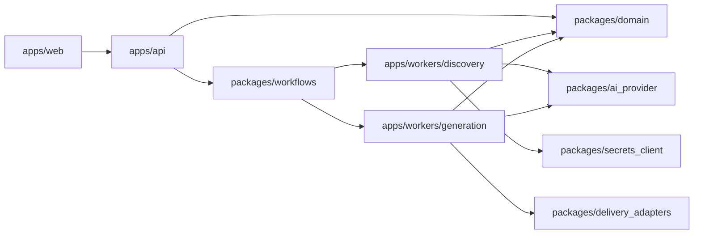
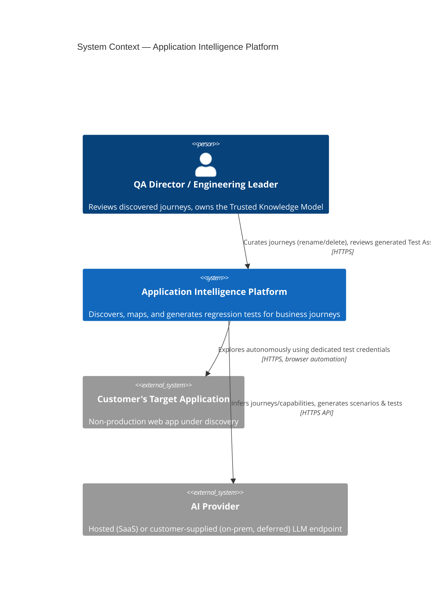
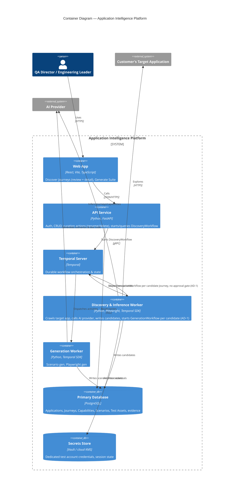
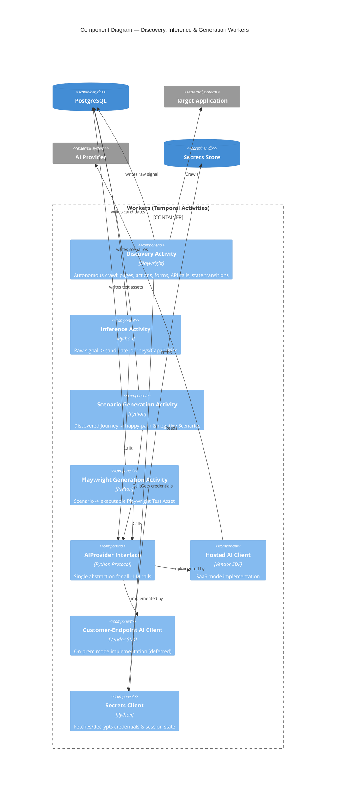
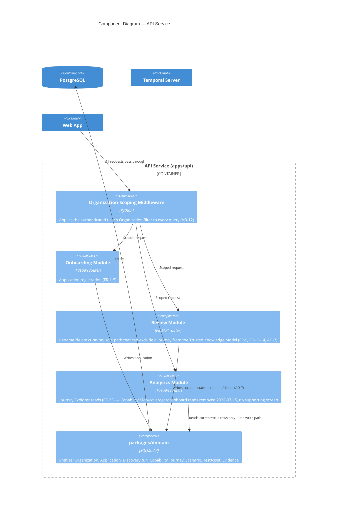
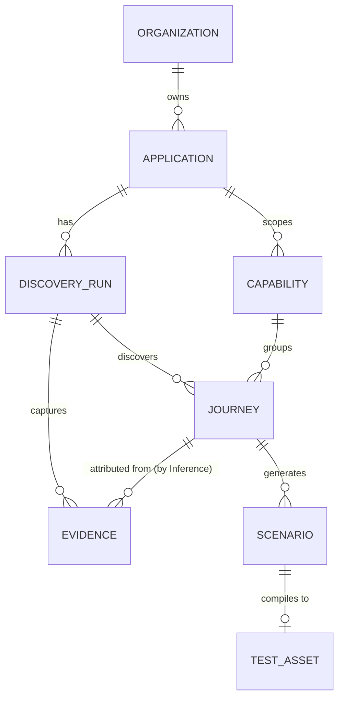

# Architecture Spine — Application Intelligence Platform

## Design Paradigm

**Durable Orchestrated Pipeline with Ports & Adapters at the boundaries.** The product's core mechanic — discover → infer → *human gate* → generate → deliver — is a multi-stage pipeline where stages are long-running, retriable, and independently ownable. Temporal Workflows carry the pipeline's coordination; Temporal Activities are the only place side effects (browser automation, LLM calls, DB writes, Git operations) happen. Everything the platform doesn't control — the AI provider, the customer's Git/CI provider, the secrets store — sits behind a named interface (a "port"), with swappable implementations ("adapters"). This is what lets V2/V3 add new AI-heavy capability, and later on-prem deployment, without destabilizing V1's boundaries.

Layer → namespace map:

| Layer | Namespace | Role |
| --- | --- | --- |
| Presentation | `apps/web` | Renders state; performs no business logic |
| Command/Query surface | `apps/api` | Owns the Trusted Knowledge Model's writes; starts/queries workflows |
| Orchestration | `packages/workflows` | Coordination only — no I/O (AD-2) |
| Execution | `apps/workers/*` | All I/O-performing Activities |
| Ports | `packages/ai_provider`, `packages/delivery_adapters`, `packages/ci_instructions`, `packages/secrets_client` | Interfaces insulating the domain from vendors |
| Domain | `packages/domain` | Entities and their invariants, shared by API and workers |

## Invariants & Rules



### AD-1 — Bounded discovery workflow; generation starts immediately, not gated on human curation `[REWRITTEN 2026-07-15]`

- **Binds:** FR-6, FR-7, FR-8, FR-9, FR-13, FR-14, FR-15
- **Prevents:** Modeling unbounded human-curation latency inside a workflow's execution history; and, now that generation is no longer gated on a human decision, any ambiguity over whether Discovery → Inference → Generation is one continuous machine-driven pipeline or needs an external trigger.
- **Rule:** `DiscoveryWorkflow` is bounded: it runs Discovery + Inference, and for each candidate Journey `InferenceActivity` creates, immediately starts an independent, short-lived `GenerationWorkflow` in the same step (see AD-9) — no human action, no API call, no approval status in between. The Temporal workflow ID is `generation-{journey_id}-{attempt}`, `attempt=1` at creation. Human curation (rename via FR-12, delete via FR-13) is ordinary CRUD through `apps/api` against Postgres, entirely decoupled from workflow orchestration — renaming or deleting a Journey never touches its `GenerationWorkflow`. Deleting a Journey (soft-delete, `status=deleted`) excludes it, and anything already generated for it, from downstream reads (Generate Suite compilation, Analytics) but does **not** cancel an in-flight or completed `GenerationWorkflow` — FR-18's full regeneration is the only way to redo generation for a Journey the reviewer keeps. `[NOTE]` This reverses the original design (approval gated generation, an explicit Approve click started `GenerationWorkflow`) — see `sprint-change-proposal-2026-07-15.md` for the rationale (per-item approval doesn't scale to a real discovery run's candidate volume) and the tradeoff it accepts (PRD §12 Risk item 2).

### AD-2 — Workflows orchestrate only; Activities own all I/O

- **Binds:** `packages/workflows`, `apps/workers/*`
- **Prevents:** Non-deterministic workflow code (a direct DB call, HTTP call, or `datetime.now()` inside a Workflow breaks Temporal's replay guarantee) and, more broadly, two workers independently deciding where a side effect belongs.
- **Rule:** Code under `packages/workflows` contains no network calls, no DB access, and no direct browser/LLM/Git calls — only calls to Activities and Workflow-safe primitives (timers, signals). All I/O lives in `apps/workers/*` Activities.

### AD-3 — AI calls go through one `AIProvider` port

- **Binds:** FR-8, FR-16, FR-17
- **Prevents:** Vendor SDK calls scattered across Inference/Scenario/Playwright-generation Activities, which would make a future hosted-vs-customer-supplied-endpoint split a rewrite instead of a config change if on-prem is ever built. `[UPDATED 2026-07-15]` This was previously also bound to FR-27 (on-prem data locality); that FR is removed (on-prem deployment parked for a later release), but the port design still pays for itself even hosted-only, and keeps a future on-prem split cheap if it's ever decided.
- **Rule:** No Activity imports an AI vendor SDK directly. All inference/generation calls go through `packages/ai_provider`'s `AIProvider` interface; only that package's implementations may hold vendor-specific code.

### AD-4 — CI/CD delivery goes through one `DeliveryAdapter` port, keyed by Git host — not by CI system `[FEATURE REMOVED 2026-07-15 — port retained as forward-compatible seam]`

- **Binds:** none currently — previously FR-19, FR-20, FR-21, all removed (no supporting screen in current UX). This AD's port design is retained per Story 1.1's Structural Seed, in case CI/CD delivery is ever redesigned from scratch, but no active story builds against it.
- **Prevents:** Provider-identity branching (`if provider == "github"`) leaking into `CIDeliveryActivity` or generation logic; and, specifically, treating "GitHub Actions / GitLab CI / Jenkins / Azure DevOps" as four symmetric repo-delivery targets when Jenkins is a CI runner with no native Git-hosting/PR API of its own — a Jenkins customer's source still lives on GitHub, GitLab, or another host, and that host is what actually receives the PR or commit.
- **Rule:** `CIDeliveryActivity` calls only the `DeliveryAdapter` interface in `packages/delivery_adapters`, selected by the Application's configured **Git host** (GitHub, GitLab, or Azure Repos) — never by its CI system. FR-21's manual pipeline-wiring instructions are a separate concern, owned by `packages/ci_instructions` (see Structural Seed), keyed by the Application's configured **CI system** (GitHub Actions, GitLab CI, Jenkins, or Azure Pipelines) independently of which host it delivers to — so a Jenkins-on-GitHub customer gets the GitHub `DeliveryAdapter` plus Jenkins-flavored wiring instructions, not a "Jenkins adapter" that doesn't correspond to anything real.

### AD-5 — Discovery credentials never touch primary storage in plaintext

- **Binds:** FR-2, FR-3
- **Prevents:** A Dedicated Test Account credential or SSO/MFA session state landing in a Postgres column or an application log in recoverable form.
- **Rule:** Credentials and session state are written and read only through `packages/secrets_client`, backed by a dedicated secrets store (Vault or cloud KMS-backed envelope encryption). `packages/domain` models store a secret *reference*, never a secret value.

### AD-6 — The API's generated OpenAPI spec is the only contract between frontend and backend

- **Binds:** `apps/web`, `apps/api`
- **Prevents:** Frontend (TypeScript) and backend (Python) type definitions for the same entity drifting apart — a real risk now that they're two languages with no shared compiler.
- **Rule:** `apps/web`'s API types are generated from `apps/api`'s FastAPI/Pydantic-derived OpenAPI spec. No hand-written duplicate of a request/response shape is permitted in `apps/web`.

### AD-7 — Trusted Knowledge Model has one deletion path `[REWRITTEN 2026-07-15]`

- **Binds:** FR-9, FR-12, FR-13, FR-14
- **Prevents:** A Journey or Capability being excluded from the Trusted Knowledge Model from anywhere other than the reviewer-facing delete endpoint — e.g., a worker silently discarding a candidate it decided was low-quality, which would remove the one lever a human has over what the platform trusts.
- **Rule:** Only `apps/api`'s delete endpoint may transition a Journey/Capability's status to `deleted`. Workers may only write `candidate` (Discovery/Inference), or downstream generation status (`generated`, `delivered`) — never a deletion. `[NOTE]` There is no more `approved`/`rejected` state (FR-10/FR-11 cut) — every non-`deleted` Journey/Capability is, by definition, part of the Trusted Knowledge Model from the moment it's discovered (FR-14).

### AD-8 — Every inferred artifact keeps a live pointer back to its evidence, at the right granularity

- **Binds:** FR-8, FR-18, FR-23
- **Prevents:** A Journey/Scenario/TestAsset existing in the database with no traceable path back to the discovery signal that produced it (breaking the "auditable, not black-box" trust mechanic in `DESIGN.md`); and, specifically, a run-level-only pointer that can't answer "which evidence supports *this* Journey" when one Discovery Run yields several Journeys, or "which generation attempt produced *this* Test Asset" when FR-18 regenerates from scratch. `[UPDATED 2026-07-15]` Previously also bound to FR-24 (coverage analytics); that FR is removed, but the `current` flag this AD establishes still does real work for Generate Suite compilation, independent of any analytics screen.
- **Rule:**
  - `Evidence` rows (pages, actions, API calls) are captured during Discovery tagged with `discovery_run_id`. `InferenceActivity` — not `DiscoveryActivity` — is responsible for attributing each Evidence row it used to support a candidate Journey by setting that row's `journey_id`; a Journey's evidence trail (FR-23) is the set of `Evidence` rows where `journey_id` matches, not the whole run's signal.
  - `Journey.discovery_run_id` is set once, at creation, and is immutable — it identifies which Discovery Run *discovered* the Journey, independent of how many times it's later regenerated.
  - `Scenario` and `TestAsset` rows carry their own `generation_run_id` (the `GenerationWorkflow` attempt — AD-1 — that produced them) plus a `current: bool` flag. A new FR-18 regeneration attempt writes new `Scenario`/`TestAsset` rows with `current=true` and flips the prior attempt's rows to `current=false` (soft-superseded, retained for audit — never deleted). The Journey Explorer and coverage analytics (FR-24) only ever read `current=true` rows; "does this Journey have a Test Asset" is `EXISTS(... current=true)`.
  - `Evidence` rows store structured metadata (page URL, action type, API call signature, timestamp) in Postgres. Large binary artifacts (screenshots, full DOM snapshots) are never stored inline — `Evidence` holds an object-storage key/reference; the object-storage backend itself is deferred (Operational Envelope), but the split between structured-metadata-in-Postgres and blobs-in-object-storage is decided now.

### AD-9 — Side-effecting Activities must be idempotent under Temporal's at-least-once retry `[UPDATED 2026-07-15]`

- **Binds:** `apps/workers/discovery`, `apps/workers/generation`
- **Prevents:** A retried Activity re-doing an external side effect a customer can see — a duplicate PR, a form double-submitted against the target application — or, since `InferenceActivity` now creates a candidate Journey and starts its `GenerationWorkflow` in the same step (AD-1), a retry either double-creating the Journey row or failing to start generation for one a prior partial attempt already created.
- **Rule:** Every Activity that performs an external side effect must check-before-acting using a deterministic key derived from its inputs (e.g., a PR branch name derived from `journey_id` + `attempt`), so a retry finds and reuses its own prior effect instead of repeating it. `InferenceActivity`'s candidate-creation step is keyed by the same `identity_key` already established for re-discovery dedup (AD-13) — a retry that finds a matching `identity_key` already on the Application skips re-creating the row, then (whether just created or found from a prior attempt) starts `GenerationWorkflow` with ID `generation-{journey_id}-1`. Temporal's duplicate-workflow-ID rejection makes this step naturally idempotent on its own — there is no longer a gap between two independently-writable operations the way an approve-endpoint-triggered start had, so no separate reconciliation sweep is needed.

### AD-10 — Discovery Run completeness is a first-class, queryable status `[UPDATED 2026-07-15]`

- **Binds:** FR-7, PRD §10 Reliability NFR
- **Prevents:** A Discovery Run that failed being indistinguishable from one that finished exhaustively — silently presenting a partial map as a finished one.
- **Rule:** `DiscoveryRun.status` is one of `running | complete | failed`, set by `DiscoveryWorkflow`: `complete` on exhaustive-traversal termination, `failed` on unrecoverable error (AD-11). `apps/api` and the UI's status pill read this field directly — completeness is never inferred from the presence/absence of other data. There is no `incomplete` value — FR-5 (time budget), the only thing that used to produce it, is removed; a Discovery Run has no safety cap and runs until genuinely exhaustive (accepted risk, PRD §12 item 7).

### AD-11 — Session expiry is a named failure mode, not a silent partial result

- **Binds:** FR-3
- **Prevents:** A Discovery Run whose session expired mid-crawl producing a truncated map that looks like a normal (if small) result, instead of the graceful failure + re-authentication prompt FR-3 requires.
- **Rule:** `DiscoveryActivity` detects an auth-redirect (session expired) as a distinct condition from a normal stop condition (AD-10) and terminates the run with `DiscoveryRun.status=failed`, `failure_reason=session_expired`. `apps/api` surfaces a re-authentication prompt keyed specifically off that reason — distinguishable from any other `failed` cause.

### AD-12 — Every Application belongs to exactly one Organization; every query is Organization-scoped

- **Binds:** platform auth
- **Prevents:** Independently-built endpoints deciding "which Applications can this user see" differently — a data-leak risk across customer organizations once more than one exists. `[UPDATED 2026-07-15]` Previously also bound to FR-25 (multi-application dashboard), now removed; the tenant boundary is foundational on its own merits — multiple Applications per Organization is real regardless of whether a cross-Application dashboard exists to view them.
- **Rule:** `Organization` is a first-class entity. `Application` (and everything under it) belongs to exactly one `Organization`. `apps/api` scopes every query by the authenticated user's `Organization` through one central mechanism (e.g., a default query-layer filter), never left to individual endpoints to remember. This holds regardless of the still-open deployment-infra-topology question (see Deferred) — even a single-tenant on-prem deployment has exactly one `Organization`.

### AD-13 — Journeys carry a stable identity key, separate from their AI-generated name, for re-discovery dedup

- **Binds:** FR-15
- **Prevents:** Two engineers implementing FR-15's "is this Journey new?" check against different notions of identity — one comparing AI-generated names (which can vary slightly run to run), another comparing something else — producing inconsistent, unreliable dedup.
- **Rule:** `InferenceActivity` computes a deterministic `identity_key` for each candidate Journey from its underlying page/action/API-call signature (evidence shape), not from its AI-generated display name. On re-discovery, a new candidate whose `identity_key` matches an existing Journey in the same Application is suppressed from the review queue (FR-15) and does not alter the existing Journey's `discovery_run_id` or evidence attribution (AD-8) — the original attribution is preserved, consistent with FR-15's "existence check," a materially smaller capability than change detection.

## Consistency Conventions

| Concern | Convention |
| --- | --- |
| Naming (entities, files, interfaces, events) | Domain models: singular PascalCase (`Application`, `DiscoveryRun`, `Capability`, `Journey`, `Scenario`, `TestAsset`, `Evidence`). DB tables: snake_case plural. API JSON: camelCase (FastAPI field aliasing). Temporal workflows: PascalCase + `Workflow` (`DiscoveryWorkflow`, `GenerationWorkflow`). Activities: PascalCase + `Activity`. Ports: PascalCase + `Provider`/`Adapter`/`Client` (`AIProvider`, `DeliveryAdapter`, `SecretsClient`). |
| Data & formats (ids, dates, error shapes, envelopes) | Internal primary keys: UUIDv7 (Postgres 18 native `uuidv7()`) for index locality. Any id exposed in an API response is a separate, opaque UUIDv4 — the UUIDv7 PK never leaves the backend, since its timestamp prefix would leak record-creation time. Dates: UTC, ISO 8601, stored as `timestamptz`. API errors: RFC 7807 `application/problem+json` envelope. |
| State & cross-cutting (mutation, errors, logging, config, auth) | Trusted Knowledge Model single-deletion-path rule (AD-7). Workflows orchestrate only (AD-2). Evidence pointer required on every inferred row, at Journey vs. generation-attempt granularity (AD-8). Side-effecting Activities are idempotent under retry (AD-9). Every query is Organization-scoped (AD-12). Structured JSON logs, correlated by Temporal `workflow_id` across `apps/api` and `apps/workers/*`. Config via environment + secrets-store references only; no hardcoded vendor SDK call or deployment-mode branch outside the port packages (AD-3, AD-4). `packages/secrets_client`'s backing store (Vault vs. cloud KMS) is chosen at deploy time behind the same port — not a V1 blocker. Platform user auth (`apps/web` ↔ `apps/api`) is a distinct namespace from discovery target credentials (Dedicated Test Account) — never conflated. |

## Stack

| Name | Version |
| --- | --- |
| Python | 3.14.6 |
| FastAPI | current stable |
| SQLModel | current stable |
| Alembic | current stable |
| PostgreSQL | 18.4 |
| Temporal (Python SDK) | current GA |
| Playwright (Python) | 1.57+ |
| React | 19.x |
| Vite | 8.1.x (Vite 8, Mar 2026 — Rolldown/Oxc-based; full plugin compatibility per vite.dev) |
| TypeScript | 7.0 (GA July 8, 2026 — native Go compiler; verify AD-6's OpenAPI→TS codegen tooling supports it before adopting, else pin 5.9 as fallback) |

## Structural Seed

```text
apps/
  web/                      # React + Vite + TS SPA — Discover Journeys, Review Scenarios, Generate Suite
  api/                      # FastAPI service — auth, CRUD, curation endpoints, starts/queries workflows
  workers/
    discovery/               # DiscoveryActivity (Playwright), InferenceActivity
    generation/               # ScenarioGenerationActivity, PlaywrightGenerationActivity, CIDeliveryActivity (unbuilt — see below)
packages/
  domain/                    # SQLModel entities: Organization, Application, DiscoveryRun, Capability, Journey, Scenario, TestAsset, Evidence
  workflows/                  # DiscoveryWorkflow, GenerationWorkflow — orchestration only (AD-2)
  ai_provider/                 # AIProvider interface + hosted implementation (AD-3); on-prem implementation not built, see Deferred
  delivery_adapters/            # DeliveryAdapter interface — retained as a forward-compatible seam (AD-4); CI/CD Delivery feature removed 2026-07-15, no adapter implementations built
  ci_instructions/               # CIInstructionsGenerator interface — same status as delivery_adapters above; no templates built
  secrets_client/               # SecretsClient interface + Vault/KMS implementation (AD-5)
migrations/                  # Alembic migration scripts
```

`[NOTE — 2026-07-15]` `delivery_adapters/` and `ci_instructions/` are scaffolded as empty port interfaces only (Story 1.1) — no adapter/generator implementations, and no story builds against them, since CI/CD Delivery (Epic 5) is removed. They're kept in the seed because an empty interface costs nothing and preserves the seam if this is ever redesigned; do not read their presence as "CI/CD delivery is in scope." The diagrams later in this document (Containers, Components, Sequence) still depict `CIDeliveryActivity` and related nodes for the same reason — original structural design, not current build scope.

### Operational Envelope

Decided now (independent of the still-open deployment-infra-topology question, see Deferred): every `apps/*` service ships as its own container image; the platform's own CI (build/test/lint on this codebase — distinct from the removed customer-facing CI/CD delivery feature) runs on GitHub Actions; traces and metrics extend the existing logging convention — every span/metric is correlated by Temporal `workflow_id`, matching the log-correlation convention above, via OpenTelemetry.

Deferred (genuinely coupled to the SaaS/on-prem topology decision, not decidable in isolation): where Temporal itself runs (self-hosted cluster vs. Temporal Cloud), the object-storage backend for raw discovery-evidence blobs (see AD-8 note below), and the production infra/provider choice.

### System Context



*(2026-07-15: `gitProvider` and its delivery Rel removed from this diagram — CI/CD delivery is cut in full, see AD-4/Module Map. The separate "Engineering Leader" actor is merged into `qa` — its only Rel was the now-removed release-readiness dashboard.)*

### Containers



*(2026-07-15: `gitProvider` and its delivery Rel removed — CI/CD delivery is cut in full; `DeliveryAdapter` port is retained only as an unbuilt seam, see AD-4. Renamed "Generation & Delivery Worker" → "Generation Worker" and dropped Web App's Capability Map/Dashboards, matching the Deferred section.)*

### Components — Workers



*(2026-07-15: CI Delivery Activity, the `DeliveryAdapter` interface and its GitHub/GitLab/Azure Repos adapters, the CI Instructions Generator, and the `gitProvider` external system removed from this diagram — none are built, the feature is removed in full (see AD-4/Module Map). The retained port contracts are documented as text in Module Contracts below, not depicted here as implemented components.)*

### Components — API Service

The same "one module, one job" rule applies inside `apps/api`. Onboarding, Review, and Analytics never call each other directly or share handler code — each talks only to `packages/domain`, and every one of them passes through the same Organization-scoping middleware (AD-12) rather than re-implementing tenant isolation.



### Module Contracts ("C4" — the interfaces this spine actually fixes)

No implementation exists yet, so a class diagram would be fiction. What *is* fixed, and genuinely worth a developer reading before writing a line of code, is the shape of each port and each module's Activity signature — because these are exactly what two independently-built modules must agree on byte-for-byte to stay loosely coupled. Everything not listed here (internal helper functions, private classes) is left to the implementer.

**Ports** (`packages/*`, AD-3/AD-4/AD-5):

```text
# packages/ai_provider
class AIProvider(Protocol):
    def infer_journeys(evidence: list[Evidence]) -> list[JourneyCandidate]: ...
    def generate_scenarios(journey: Journey, evidence: list[Evidence]) -> list[Scenario]: ...
    def generate_playwright(scenario: Scenario) -> TestAssetCode: ...
# Implementations: HostedAIProvider (SaaS), CustomerEndpointAIProvider (on-prem, deferred)

# packages/delivery_adapters — retained as a forward-compatible seam; CI/CD delivery feature removed 2026-07-15, no implementations built (AD-4)
class DeliveryAdapter(Protocol):
    def deliver(test_asset: TestAsset, application: Application, mode: Literal["pr", "direct_commit"]) -> DeliveryResult: ...
# Implementations: none built — GitHubAdapter/GitLabAdapter/AzureReposAdapter were the planned shape, keyed by Git host (AD-4), not CI system

# packages/ci_instructions — retained as a forward-compatible seam; feature removed 2026-07-15, no templates built
class CIInstructionsGenerator(Protocol):
    def render(ci_system: Literal["github_actions", "gitlab_ci", "jenkins", "azure_pipelines"]) -> InstructionsTemplate: ...

# packages/secrets_client
class SecretsClient(Protocol):
    def store(organization_id: UUID, secret: bytes) -> SecretRef: ...
    def resolve(ref: SecretRef) -> bytes: ...
# Implementations: VaultSecretsClient, CloudKMSSecretsClient — chosen at deploy time
```

**Module Activities** (input → output, per Module Map row above):

```text
DiscoveryActivity(application: Application, secret_ref: SecretRef) -> DiscoveryRun
InferenceActivity(discovery_run: DiscoveryRun, evidence: list[Evidence]) -> list[Journey]
ScenarioGenerationActivity(journey: Journey) -> list[Scenario]
PlaywrightGenerationActivity(scenario: Scenario) -> TestAsset
# CIDeliveryActivity(test_asset: TestAsset, application: Application) -> DeliveryResult  — retained signature, unbuilt; CI/CD delivery removed 2026-07-15, see Module Map
```

Every Activity signature above takes and returns `packages/domain` types only — never a raw dict or a type private to one worker — which is what makes AD-9's idempotency contract and AD-2's "Workflows call Activities, not each other's internals" enforceable at a type-checker level, not just a code-review convention.

### Sequence — Discovery to Delivery

```mermaid
sequenceDiagram
    actor QA as QA Director
    participant SPA as Web App
    participant API as API Service
    participant TMP as Temporal
    participant DW as Discovery/Inference Worker
    participant DB as Postgres
    participant TGT as Target Application
    participant AI as AI Provider
    participant GW as Generation Worker

    QA->>SPA: Configure Application (URL, creds) — submit starts discovery immediately (2026-07-15: no scope/time-budget config, FR-4/FR-5 removed)
    SPA->>API: POST /applications
    API->>DB: Create Application record
    API->>TMP: Start DiscoveryWorkflow
    TMP->>DW: Dispatch DiscoveryActivity
    DW->>TGT: Explore (pages, actions, forms, APIs), full Application
    alt session expired mid-crawl
        DW->>DB: DiscoveryRun.status=failed, reason=session_expired (AD-11)
        Note over DW: Workflow ends; API surfaces re-auth prompt
    else exhaustive traversal (FR-7 — only stop condition, no time budget)
        DW->>DB: Persist raw Evidence (tagged discovery_run_id only)
        DW->>DB: DiscoveryRun.status=complete (AD-10)
        TMP->>DW: Dispatch InferenceActivity
        DW->>AI: Infer Journeys/Capabilities from Evidence
        AI-->>DW: Candidate Journeys/Capabilities (business language)
        DW->>DB: Write candidate Journeys (status=candidate, identity_key set — AD-13)
        DW->>DB: Attribute supporting Evidence rows to their Journey (journey_id — AD-8)
        Note over DW: For each candidate Journey just created, immediately start GenerationWorkflow(id="generation-{journeyId}-1") — no approval gate (AD-1, AD-9)
        DW->>TMP: Start GenerationWorkflow per candidate Journey
        Note over TMP: DiscoveryWorkflow completes (bounded — AD-1)
    end

    TMP->>GW: Dispatch ScenarioGenerationActivity
    GW->>AI: Generate happy-path + negative scenarios
    AI-->>GW: Scenarios
    GW->>DB: Write Scenarios
    TMP->>GW: Dispatch PlaywrightGenerationActivity
    GW->>AI: Generate Playwright code from Scenario
    AI-->>GW: Playwright Test Asset
    GW->>DB: Write Test Asset

    Note over QA,API: Curation (rename/delete) is decoupled from the above — a reviewer can act any time, before, during, or after generation completes (AD-1)
    QA->>SPA: Open Discover Journeys
    SPA->>API: GET /discover-journeys
    API->>DB: Read candidates
    QA->>SPA: Rename or Delete a Journey
    SPA->>API: PATCH/DELETE /journeys/{id}
    API->>DB: Update name, or status=deleted excluding it from downstream reads (Trusted Knowledge Model — AD-7)
```

*(2026-07-15: CI Delivery dispatch — `CIDeliveryActivity` → customer Git host → delivery confirmation — and the Dashboard/`GET /analytics` coverage flow removed from this sequence; neither is built, see Module Map/Deferred. Generate Suite's post-generation execution step is a confirmed UI placeholder with no architecture decision made yet, see Deferred.)*

### Core-Entity ERD



`ORGANIZATION` is the tenant boundary (AD-12) — every query in `apps/api` is scoped by it. `EVIDENCE` is captured against a `DISCOVERY_RUN` first and attributed to a `JOURNEY` second, by `InferenceActivity` (AD-8) — the two relationships above are sequential, not redundant.

*(2026-07-15: `CI_CONFIG` entity and its relation removed — no feature configures a Git host/export mode; CI/CD delivery is cut in full, see AD-4/Module Map.)*

## Module Map

Every PRD feature area is one loosely-coupled module: a single Activity, endpoint group, or port package with one job, talking to its neighbors only through the domain (Postgres) or a port interface — never by importing another module's internals. This is the enforceable version of "loosely coupled": each row's **Isolation** column is what AD-2/AD-3/AD-4/AD-9 actually buy — a change contained to one module without a ripple.

| Module | Responsibility | Enables | Inputs | Outputs (where to observe) | Depends on | Isolation — what a fix/enhancement touches |
| --- | --- | --- | --- | --- | --- | --- |
| **Onboarding**<br>`apps/api` Application router, `packages/secrets_client` | Register an Application; capture URL, env, credentials; starts `DiscoveryWorkflow` immediately on submit | FR-1–3 | Form submission from `apps/web` | `Application` row (Postgres); secret reference in SecretsClient | `packages/domain`, `packages/secrets_client` (AD-5) | A new credential type stays inside this module + its SecretsClient implementation. `[UPDATED 2026-07-15]` No scope/time-budget capture — FR-4/FR-5 removed. |
| **Discovery**<br>`apps/workers/discovery` (`DiscoveryActivity`), `DiscoveryWorkflow` | Autonomously explore the entire target app; detect the exhaustive-traversal stop condition | FR-6–7 | `Application` config + credentials (via SecretsClient) | `Evidence` rows + `DiscoveryRun.status` (Postgres) | Target Application (external), SecretsClient | A new crawl strategy never touches Inference or Review — it only ever writes `Evidence` + `DiscoveryRun.status`. `[UPDATED 2026-07-15]` No scope/budget config to respect — always full-Application, exhaustive-traversal only |
| **Inference**<br>`apps/workers/discovery` (`InferenceActivity`) | Raw Evidence → candidate Journeys/Capabilities; attribute Evidence to a Journey; compute `identity_key`; `[UPDATED 2026-07-15]` immediately starts `GenerationWorkflow` per candidate (AD-1) — no approval gate | FR-8, FR-14, FR-15 | `Evidence` rows from Discovery | `Journey`/`Capability` rows (`status=candidate`), `Evidence.journey_id`, one `GenerationWorkflow` started per candidate | `AIProvider` port (AD-3) | Changing the inference prompt/model, or the `identity_key` fingerprint (AD-13), never touches Discovery's crawl code or Review's curation logic |
| **Review**<br>`apps/api` review endpoints, `packages/domain` | `[UPDATED 2026-07-15]` Human rename / delete curation; sole path that can exclude a Journey from the Trusted Knowledge Model — no approve/reject, no longer starts `GenerationWorkflow` (moved to Inference, above) | FR-9, FR-12–14 | Candidate Journeys/Capabilities; reviewer action from `apps/web` | `status=deleted`, or updated name | `packages/domain` (AD-7) | A new curation action is isolated to this module — Discovery, Inference, and Generation only ever read `status`, never assume how it got there |
| **Scenario Generation**<br>`apps/workers/generation` (`ScenarioGenerationActivity`) | Discovered Journey → happy-path + negative Scenarios, triggered immediately at creation (no approval gate) | FR-14, FR-16 | Discovered `Journey` + its Evidence | `Scenario` rows | `AIProvider` port | Swapping the scenario strategy never touches Playwright generation — they share a workflow, not code |
| **Playwright Generation**<br>`apps/workers/generation` (`PlaywrightGenerationActivity`) | Scenario → executable Playwright Test Asset; owns regeneration/versioning | FR-17–18 | `Scenario` rows | `TestAsset` rows (code + `current` flag, AD-8) | `AIProvider` port | Regeneration/versioning logic changes stay inside this module; Scenario Generation is untouched |
| **CI Delivery** `[REMOVED 2026-07-15]`<br>`apps/workers/generation` (`CIDeliveryActivity`), `packages/delivery_adapters` | Push a Test Asset into the customer's repo (PR or direct commit) | — (previously FR-19–20, removed) | `TestAsset` + Application's configured Git host | PR/commit on the customer's Git host | `DeliveryAdapter` port (AD-4), AD-9 | Port contract retained as a forward-compatible seam (no harm keeping it ready); no story builds against it in current scope — see Deferred section |
| **CI Instructions** `[REMOVED 2026-07-15]`<br>`packages/ci_instructions` | Produce the manual pipeline-wiring template for the Application's CI system | — (previously FR-21, removed) | Application's configured CI system | Instructions/template surfaced in `apps/web` | none — pure function of CI system | Port contract retained as a forward-compatible seam; not scheduled for V1 build — see Deferred section |
| **Analytics** `[TRIMMED 2026-07-15]`<br>`apps/api` analytics endpoints, `apps/web` | Journey step/evidence detail, retained, served inline from the discovery-review flow, not a standalone screen | FR-23 | `current=true` Journey/Capability/TestAsset rows, Organization scope | Read views only | `packages/domain` (read-only) | A new dashboard view can never corrupt Trusted Knowledge Model state — Analytics has no write path into `packages/domain`. (Capability Map, coverage analytics, executive dashboard — previously FR-22/24/25 — removed in full, no supporting screen.) |
| **Tenancy**<br>`packages/domain` (`Organization`), `apps/api` scoping | Owns the Organization boundary every other module's queries run through | platform auth (the tenant boundary is foundational, independent of any specific feature) | Authenticated user session | Query-layer filter applied platform-wide (AD-12) | none — foundational | A data-isolation bug is fixable in exactly one place — the central scoping mechanism — never in N separate endpoints |
| **Deployment topology** `[INFRA QUESTION, STILL OPEN — feature removed 2026-07-15]` | Where Temporal/services run (SaaS-hosted vs. self-hosted); AI-provider-mode *configuration UI* is removed (Epic 7), but the underlying infra-hosting-location question is unrelated and still genuinely open | — (previously FR-26–27; the customer-facing feature those bound is removed, the infra question survives independently) | — | — | `AIProvider` port keeps a future customer-supplied-endpoint mode addable later | See Deferred section |

## Deferred

- **`[NEW — 2026-07-15]` Test-suite execution mechanism**: Generate Suite's `Run immediately`/`Schedule for later`/`Save without running` controls are a confirmed UI placeholder only (user-stated: "currently it is placeholder, we will tag the integration later"). **No architecture decision is made here.** Specifically: do not read "Run immediately" as authorizing the platform to execute generated tests itself — that would silently contradict the "no CI read-back channel" stance without a real decision ever having been made. Revisit once the mechanism is actually specified; it may turn out to be a revival of the removed CI Delivery module (below), a genuinely new test-runner capability, or something else entirely.
- **`[REMOVED 2026-07-15, was "deferred"]` CI/CD delivery**: removed in full, not merely deferred — the Connect to CI/CD screen this depended on has no equivalent anywhere in the current UX (see `sprint-change-proposal-2026-07-15.md`). The `DeliveryAdapter`/`CIInstructionsGenerator` port contracts (AD-4) are unchanged and retained as a forward-compatible seam, ready to implement against if this feature is ever redesigned from scratch — but there is no scheduled path back to it.
- **`[REMOVED 2026-07-15, was "deferred"]` Analytics surfaces**: Capability Map, coverage analytics, and the multi-application executive dashboard are removed in full — no screen in the current UX serves any of them. Journey detail (FR-23) is unaffected — it's retained, served inline from the discovery-review flow instead of a standalone screen.
- **`[REMOVED 2026-07-15]` AI-provider-mode configuration UI**: the Settings screen — the only confirmed V1 entry point for this — has no equivalent in the current UX, and on-premises deployment as a customer-facing feature is confirmed parked for a later release — a settled scope decision, not a compliance NFR awaiting reconfirmation.
- **Deployment infra topology (where Temporal/services run) — still genuinely open, independent of the removed feature above**: single deployable vs. divergent builds, infra/provider choice, self-hosted vs. Temporal Cloud. This is NOT the same question as "AI-provider-mode configuration UI" above (that's a removed customer-facing feature; this is an internal infra decision the platform needs regardless of whether on-prem is ever offered as a product option). AD-3's `AIProvider` port means a future hosted/on-prem split doesn't require rework of Activities — only a new port implementation, if and when that's decided. Note: the *tenant/organization data boundary* (AD-12) is decided regardless — even a single-tenant on-prem deployment has exactly one `Organization`.
- **Object-storage backend for raw evidence blobs** (screenshots, DOM snapshots): the split itself — structured metadata in Postgres, binary artifacts referenced by object-storage key — is decided (AD-8); the specific object-storage provider is coupled to the infra-topology question above.
- **SSO/MFA session-state capture mechanism** (PRD Open Question 8): how a customer actually hands off a reusable session state is unresolved in the PRD itself. **Blocks** detailed design of the Onboarding flow's auth step (FR-3) — must resolve before that slice is built.
- **`[MOOT 2026-07-15]` Direct-commit regeneration conflict handling** (previously PRD Open Question 6): what happens when a direct-commit delivery path overwrites a customer's manually-edited test file is now moot — direct-commit export doesn't exist as a feature (CI Delivery removed, above). Would need to be re-raised if CI/CD delivery is ever redesigned.
- **Non-production technical safeguard** (PRD Open Question 3): currently customer-responsibility only (PRD §11); no platform-side guardrail is designed against `DiscoveryActivity` targeting a production environment.
- **`[CUT 2026-07-15]` Review-queue live-count indicator**: confirmed cut, not deferred — its only home, the nav rail, is retired, and no on-screen replacement is being built. See `sprint-change-proposal-2026-07-15.md` and Story 3.1.
- **Confidence/risk scoring reintroduction path**: cut for V1 per PRD §5/addendum. Not designed against here; AD-8's evidence-pointer requirement leaves room for a future discovery-signal-only confidence score without restructuring the domain model.
- **Reviewer prioritization/importance-marking**: out of V1 scope per PRD §5; no architecture accommodation made.
- **Tenant billing/plan model**: AD-12 fixes the data-isolation boundary (every query is Organization-scoped); billing, plan tiers, and seat management are unaddressed and out of this spine's scope.
- **V2 source-code correlation / V3 change-impact prediction**: out of this spine's altitude entirely. AD-3's port boundary is the intentional seam — a future code-analysis/retrieval capability can be added as a new worker or service behind the existing `AIProvider`/`domain` boundaries rather than requiring a V1 rewrite.
