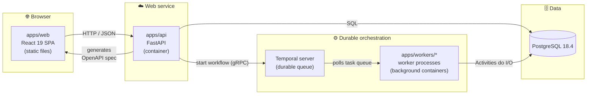

# 🧭 Developer Guide — AITestGen

> **Start here.** This is the canonical onboarding doc for the AITestGen monorepo.
> By the end you'll understand *what each part of the system does*, *where it runs*,
> and *how to bring the whole stack up locally* to validate a story — frontend,
> backend, database, and durable workflows all working together.

| | |
|---|---|
| **Project** | AITestGen — Application Intelligence Platform |
| **Paradigm** | Durable Orchestrated Pipeline with Ports & Adapters |
| **Current state** | Story 1.1 — scaffolding complete, no product feature yet |
| **Source of truth** | `_bmad-output/planning-artifacts/architecture/` |

---

## 📑 Table of contents

1. [The 60-second mental model](#-the-60-second-mental-model)
2. [Architecture at a glance](#-architecture-at-a-glance)
3. [Module map — what runs where](#-module-map--what-runs-where)
4. [The core rules (don't break these)](#-the-core-rules-dont-break-these)
5. [Prerequisites](#-prerequisites)
6. [Local runbook — bring the whole stack up](#-local-runbook--bring-the-whole-stack-up)
7. [Validating a story visually](#-validating-a-story-visually)
8. [Health checklist (mirrors CI)](#-health-checklist-mirrors-ci)
9. [Troubleshooting](#-troubleshooting)
10. [Glossary](#-glossary)

---

## 🧠 The 60-second mental model

Story 1.1 built **scaffolding, not features** — the foundation, plumbing, and wiring
of the house before any room is furnished. Its entire job was to prove, end to end,
that every technology in the stack can talk to every other one.

The proof signal is a single throwaway entity called **`ScaffoldProbe`**. It flows
through the *whole* system:

```
browser → React → HTTP → FastAPI → SQLModel → PostgreSQL → back to the browser
```

If the scaffold-probe page renders in your browser, **the entire frontend ↔ backend ↔ database path works.** That's the litmus test.

Two architectural ideas drive everything:

- **Ports & Adapters** — external concerns (AI vendors, secret stores) live behind
  fixed `Protocol` interfaces. The core never imports a vendor SDK directly.
- **Durable orchestration** — long-running work is a **Temporal workflow** (durable,
  resumable) that *orchestrates only*. The real I/O lives in **Activities**, executed
  by **worker** processes — never inside the workflow itself.

---

## 🏗 Architecture at a glance



> [!NOTE]
> **The OpenAPI spec is the only contract between web and api (AD-6).** The frontend's
> TypeScript types are *generated* from the API's `/openapi.json`. No request/response
> shape is ever hand-typed in `apps/web`, and CI fails the build if the checked-in
> generated types drift from what the API actually produces.

---

## 🗂 Module map — what runs where

### Deployable runtimes

| Module | Responsibility | Stack | Deploys as |
|---|---|---|---|
| **`apps/web`** | UI only. Renders pages, calls the API. | React 19 · Vite 8 · TypeScript 5.9.3 | Static assets on a CDN / web server (`vite build`) — **not** a Node server |
| **`apps/api`** | Auth, CRUD, curation; starts & queries workflows. | FastAPI · SQLModel · Alembic | Container running `uvicorn` (web service / pod) |
| **`apps/workers/generation`** | Runs the durable generation pipeline (LLM inference, test generation — Epic 4). | Temporal Python SDK | Always-on background container (no HTTP port; polls Temporal) |
| **`apps/workers/discovery`** | Playwright crawling + inference (Epic 2). Directory scaffold only today. | Temporal · Playwright | Always-on background container |

### Shared libraries (imported, never deployed alone)

| Package | Responsibility | Status |
|---|---|---|
| **`packages/domain`** | SQLModel entities shared by api + workers. | Holds only `ScaffoldProbe` today (disposable). Real model = Story 1.2 |
| **`packages/workflows`** | Temporal workflows — **orchestration only, zero I/O (AD-2)**. | No-op `GenerationWorkflow` shell; grows up in Story 2.5 |
| **`packages/ai_provider`** | `AIProvider` port (AD-3) — all inference goes through here. | Interface stub only; implementations in Epic 2/7 |
| **`packages/secrets_client`** | `SecretsClient` port (AD-5) — credentials never touch a plaintext DB column. | Interface stub only; implementation in Story 1.3 |
| **`packages/delivery_adapters`** | `DeliveryAdapter` port. | Retained seam only — feature removed, nothing implements it |
| **`packages/ci_instructions`** | `CIInstructionsGenerator` port. | Retained seam only — feature removed |

### Root infrastructure

| File | Purpose |
|---|---|
| `pyproject.toml` | `uv` workspace tying all Python packages together (Python 3.14.6) + ruff/pyright/pytest config |
| `docker-compose.yml` | Local-dev **Postgres 18.4 + Temporal dev server** (dev ergonomics only — *not* the production hosting decision) |
| `alembic.ini` + `migrations/` | Database migrations (Alembic). First migration creates the `scaffold_probe` table |
| `.github/workflows/ci.yml` | CI: Python job · Web job · **API-types drift check** (enforces AD-6) |

---

## 📏 The core rules (don't break these)

> [!IMPORTANT]
> These are architecture invariants, not style preferences. Later stories depend on
> them being upheld byte-for-byte.

| # | Rule | Why it matters |
|---|---|---|
| **AD-2** | Workflows in `packages/workflows` contain **zero I/O** — no DB, network, browser, or LLM calls. All I/O lives in Activities run by workers. | Temporal replays workflow code to recover from failure; any I/O inside a workflow breaks determinism. |
| **AD-3** | Every inference call goes through the `AIProvider` port. No Activity imports a vendor SDK directly. | Lets us swap hosted ↔ on-prem AI without touching business logic. |
| **AD-5** | Secrets are read/written only via `SecretsClient`, backed by a real secrets store — never a plaintext DB column. | Security boundary. |
| **AD-6** | The OpenAPI spec is the **only** contract between web and api. Regenerate `apps/web/src/api-types.gen.ts`; never hand-edit it. | CI's drift check enforces this — a hand-typed shape silently rots the first time someone's in a hurry. |
| **PK convention** | Internal primary keys are **UUIDv7** (`uuidv7()` Postgres default), set by `ScaffoldProbe`. | Index locality; every new table copies this pattern. |

---

## ✅ Prerequisites

Confirmed working in this repo. Versions are the ones the scaffold was built and tested against.

| Tool | Version | Notes |
|---|---|---|
| [uv](https://docs.astral.sh/uv/) | 0.11+ | Python 3.14.6 auto-installed via `.python-version` |
| Node.js | 22.18+ | For `apps/web` |
| Docker | 28+ | For local Postgres + Temporal |

---

## 🚀 Local runbook — bring the whole stack up

You'll need up to **4 terminals**. Run everything from the repo root unless noted.

### One-time setup

```bash
uv sync --all-packages                    # install all Python deps into .venv
cd apps/web && npm install && cd ../..     # install web deps
```

### Step 1 — Start infrastructure (Postgres + Temporal)

```bash
docker compose up -d
```

- Postgres → `localhost:5432`
- Temporal Web UI → **http://localhost:8233**

### Step 2 — Apply database migrations

```bash
uv run alembic upgrade head
```

Creates the `scaffold_probe` table.

### Step 3 — Terminal A: run the API

```bash
uv run --package api uvicorn api.main:app --reload --port 8000
```

Verify:
- **http://localhost:8000/health** → `{"status":"ok"}`
- **http://localhost:8000/docs** → interactive Swagger UI
- **http://localhost:8000/openapi.json** → the contract that drives the frontend types

### Step 4 — Terminal B: run the frontend

```bash
cd apps/web
npm run dev
```

Open **http://localhost:5173**. You should see the **Scaffold probe** page showing an
`id` (a UUIDv7), `note: scaffold-ok`, and a timestamp.

> ✅ **That page rendering = frontend ↔ backend ↔ database are all wired correctly.**

### Step 5 (optional) — Verify durable workflows end to end

```bash
# Terminal C — start the worker (polls Temporal)
uv run --package generation-worker python -m generation_worker.worker

# Terminal D — fire the smoke test
uv run --package api python -m api.scripts.temporal_smoke_test
```

Expect: `Temporal smoke test OK — workflow … completed with result='ok'`.
Watch it live in the Temporal UI at **http://localhost:8233**.

### ⚠️ Whenever the API contract changes (AD-6)

If a story changes any request/response shape, regenerate the frontend types or CI
will fail:

```bash
# with the API running on :8000
cd apps/web && npm run generate:api-types
```

---

## 🔍 Validating a story visually

The loop you learned above is the **same loop for every future story**:

```
docker compose up -d  →  alembic upgrade head  →  API  →  web  →  (worker + Temporal)
```

What changes per epic:

- **Story 1.2 / 1.3** — replace `ScaffoldProbe` with the real `Organization` / `Application` / auth
  model and implement `SecretsClient`. Same loop; the SPA shows real data instead of the probe.
- **Epic 2+** — fill in the workers (`DiscoveryActivity` with Playwright) and grow the no-op
  workflow into real generation logic. Terminal C + the Temporal UI (`:8233`) is how you watch
  those run.

---

## 🧪 Health checklist (mirrors CI)

Run these before pushing — they mirror `.github/workflows/ci.yml` exactly.

**Python**

```bash
uv run ruff check .      # lint
uv run pyright           # type-check
uv run pytest            # tests (the DB test skips if no Postgres is reachable)
```

**Web** (from `apps/web`)

```bash
npm run lint             # oxlint
npx tsc -b               # type-check
npm test                 # vitest
npx vite build           # production build
```

**Contract drift (AD-6)** — with the API running on `:8000`:

```bash
cd apps/web && npm run generate:api-types
git diff --exit-code apps/web/src/api-types.gen.ts   # must be clean
```

---

## 🛠 Troubleshooting

| Symptom | Likely cause | Fix |
|---|---|---|
| Scaffold-probe page shows *"Scaffold probe failed"* | API not running or CORS/port mismatch | Confirm the API is up on `:8000` and `/health` returns ok |
| `pytest` DB test skipped | No Postgres reachable | `docker compose up -d`, then set `DATABASE_URL` if non-default |
| `alembic upgrade head` connection error | Postgres not up yet | Wait for the container healthcheck, then retry |
| Temporal smoke test hangs | Worker (Terminal C) not running | Start the generation worker first |
| CI `api-types` job red | `api-types.gen.ts` was hand-edited or stale | Regenerate against a running API and commit the result |
| Frontend can't reach API | Vite origin not allowed | Dev CORS allows `http://localhost:5173` only — use that origin |

---

## 📖 Glossary

| Term | Meaning |
|---|---|
| **Port** | A `Protocol` interface (`AIProvider`, `SecretsClient`, …) the core depends on; adapters implement it later. |
| **Adapter** | A concrete implementation of a port (e.g. `VaultSecretsClient`). None exist yet. |
| **Workflow** | Temporal-orchestrated, durable, replayable code — **no I/O**. |
| **Activity** | A unit of real work (DB/network/browser/LLM) dispatched by a workflow, run by a worker. |
| **Worker** | A process that polls a Temporal task queue and executes workflows + activities. |
| **Task queue** | The named channel (`generation-task-queue`) a workflow start is routed through to its worker. |
| **ScaffoldProbe** | The disposable proof-of-wiring entity. Delete once the real domain model lands. |

---

*Questions or something out of date? This guide lives at `docs/DEVELOPER_GUIDE.md` — update it in the same PR that changes the behavior it describes.*
