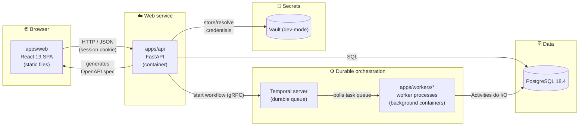

# 🧭 Developer Guide — AITestGen

> **Start here.** This is the canonical onboarding doc for the AITestGen monorepo.
> By the end you'll understand *what each part of the system does*, *where it runs*,
> and *how to bring the whole stack up locally* to validate a story — frontend,
> backend, database, and durable workflows all working together.

| | |
|---|---|
| **Project** | AITestGen — Application Intelligence Platform |
| **Paradigm** | Durable Orchestrated Pipeline with Ports & Adapters |
| **Current state** | Stories 1.1–1.3 — sign-in, Organization scoping, and Application onboarding work end-to-end |
| **Source of truth** | `_bmad-output/planning-artifacts/architecture/` |

---

## 📑 Table of contents

1. [The 60-second mental model](#-the-60-second-mental-model)
2. [Architecture at a glance](#-architecture-at-a-glance)
3. [Module map — what runs where](#-module-map--what-runs-where)
4. [The core rules (don't break these)](#-the-core-rules-dont-break-these)
5. [Prerequisites](#-prerequisites)
6. [Local runbook — bring the whole stack up](#-local-runbook--bring-the-whole-stack-up)
7. [Validating a story visually](#-validating-a-story-visually)
8. [Health checklist (mirrors CI)](#-health-checklist-mirrors-ci)
9. [Troubleshooting](#-troubleshooting)
10. [Glossary](#-glossary)

---

## 🧠 The 60-second mental model

Story 1.1 built **scaffolding, not features** — the foundation, plumbing, and wiring
of the house before any room is furnished. Its proof signal was a throwaway entity
called `ScaffoldProbe`, which has since been deleted now that real features exist.

Stories 1.2 and 1.3 are the first real features, and together they trace the same
end-to-end path `ScaffoldProbe` proved, now doing real work:

```
browser → sign in (React) → HTTP → FastAPI (session cookie, Organization scoping)
        → SQLModel → PostgreSQL (Organization/PlatformUser/Application/DiscoveryRun)
        → SecretsClient → Vault (credentials, never plaintext)
        → Temporal → discovery worker (DiscoveryWorkflow)
```

If you can sign in, land on Home, submit the Connect App form, and see the top bar
pick up the new Application's name + environment badge, **the entire stack is wired
correctly.** That's the litmus test now.

Two architectural ideas drive everything:

- **Ports & Adapters** — external concerns (AI vendors, secret stores) live behind
  fixed `Protocol` interfaces. The core never imports a vendor SDK directly.
- **Durable orchestration** — long-running work is a **Temporal workflow** (durable,
  resumable) that *orchestrates only*. The real I/O lives in **Activities**, executed
  by **worker** processes — never inside the workflow itself.

---

## 🏗 Architecture at a glance



> [!NOTE]
> **The OpenAPI spec is the only contract between web and api (AD-6).** The frontend's
> TypeScript types are *generated* from the API's `/openapi.json`. No request/response
> shape is ever hand-typed in `apps/web`, and CI fails the build if the checked-in
> generated types drift from what the API actually produces.

---

## 🗂 Module map — what runs where

### Deployable runtimes

| Module | Responsibility | Stack | Deploys as |
|---|---|---|---|
| **`apps/web`** | UI only. Renders pages, calls the API. | React 19 · Vite 8 · TypeScript 5.9.3 | Static assets on a CDN / web server (`vite build`) — **not** a Node server |
| **`apps/api`** | Auth, CRUD, curation; starts & queries workflows. | FastAPI · SQLModel · Alembic | Container running `uvicorn` (web service / pod) |
| **`apps/workers/generation`** | Runs the durable generation pipeline (LLM inference, test generation — Epic 4). | Temporal Python SDK | Always-on background container (no HTTP port; polls Temporal) |
| **`apps/workers/discovery`** | Runs the no-op `DiscoveryWorkflow` shell today (started by onboarding, Story 1.3). Real Playwright crawling + inference (Epic 2) lands as Activities on this same worker. | Temporal · Playwright | Always-on background container |

### Shared libraries (imported, never deployed alone)

| Package | Responsibility | Status |
|---|---|---|
| **`packages/domain`** | SQLModel entities shared by api + workers. | `Organization`, `PlatformUser`, `Application`, `DiscoveryRun` (Stories 1.2/1.3) |
| **`packages/workflows`** | Temporal workflows — **orchestration only, zero I/O (AD-2)**. | No-op `GenerationWorkflow` (grows up in Story 2.5) + no-op `DiscoveryWorkflow` (grows up in Epic 2) |
| **`packages/ai_provider`** | `AIProvider` port (AD-3) — all inference goes through here. | Interface stub only; implementations in Epic 2/7 |
| **`packages/secrets_client`** | `SecretsClient` port (AD-5) — credentials never touch a plaintext DB column. | `VaultSecretsClient` adapter implemented (Story 1.3), backed by dev-mode Vault |
| **`packages/delivery_adapters`** | `DeliveryAdapter` port. | Retained seam only — feature removed, nothing implements it |
| **`packages/ci_instructions`** | `CIInstructionsGenerator` port. | Retained seam only — feature removed |

### Root infrastructure

| File | Purpose |
|---|---|
| `pyproject.toml` | `uv` workspace tying all Python packages together (Python 3.14.6) + ruff/pyright/pytest config |
| `docker-compose.yml` | Local-dev **Postgres 18.4 + Temporal dev server + dev-mode Vault** (dev ergonomics only — *not* the production hosting decisions) |
| `alembic.ini` + `migrations/` | Database migrations (Alembic). Current tables: `organization`, `platform_user`, `application`, `discovery_run` |
| `.github/workflows/ci.yml` | CI: Python job (Postgres + Vault + Temporal services) · Web job · **API-types drift check** (enforces AD-6) |

---

## 📏 The core rules (don't break these)

> [!IMPORTANT]
> These are architecture invariants, not style preferences. Later stories depend on
> them being upheld byte-for-byte.

| # | Rule | Why it matters |
|---|---|---|
| **AD-2** | Workflows in `packages/workflows` contain **zero I/O** — no DB, network, browser, or LLM calls. All I/O lives in Activities run by workers. | Temporal replays workflow code to recover from failure; any I/O inside a workflow breaks determinism. |
| **AD-3** | Every inference call goes through the `AIProvider` port. No Activity imports a vendor SDK directly. | Lets us swap hosted ↔ on-prem AI without touching business logic. |
| **AD-5** | Secrets are read/written only via `SecretsClient`, backed by a real secrets store — never a plaintext DB column. | Security boundary. |
| **AD-6** | The OpenAPI spec is the **only** contract between web and api. Regenerate `apps/web/src/api-types.gen.ts`; never hand-edit it. | CI's drift check enforces this — a hand-typed shape silently rots the first time someone's in a hurry. |
| **AD-12** | Every `apps/api` query is scoped to the signed-in user's Organization through **one** central mechanism (`api.auth.current_org_id`), never re-implemented per endpoint. | The only thing standing between one customer's data and another's. |
| **PK convention** | Internal primary keys are **UUIDv7** (`uuidv7()` Postgres default). `Application`/`DiscoveryRun` additionally expose a separate **UUIDv4 `external_id`** in API responses — the UUIDv7 PK never leaves the backend (it would leak creation time). | Index locality internally; no timestamp leakage externally. |

---

## ✅ Prerequisites

Confirmed working in this repo. Versions are the ones the scaffold was built and tested against.

| Tool | Version | Notes |
|---|---|---|
| [uv](https://docs.astral.sh/uv/) | 0.11+ | Python 3.14.6 auto-installed via `.python-version` |
| Node.js | 22.18+ | For `apps/web` |
| Docker | 28+ | For local Postgres + Temporal + Vault |

---

## 🚀 Local runbook — bring the whole stack up

You'll need up to **5 terminals**. Run everything from the repo root unless noted.

### One-time setup

```bash
uv sync --all-packages                    # install all Python deps into .venv
cd apps/web && npm install && cd ../..     # install web deps
```

### Step 1 — Start infrastructure (Postgres + Temporal + Vault)

```bash
docker compose up -d
```

- Postgres → `localhost:5432`
- Temporal Web UI → **http://localhost:8233**
- Vault (dev-mode, root token `dev-only-root-token`) → **http://localhost:8200**

### Step 2 — Apply database migrations

```bash
uv run alembic upgrade head
```

Creates the `organization`, `platform_user`, `application`, `discovery_run` tables.

### Step 3 — Seed a dev Organization + user

There's no self-service registration (see Story 1.2's Dev Notes — not in scope for V1):

```bash
uv run --package api python -m api.scripts.seed_dev_data
```

Creates `dev@example.com` / `devpassword123` in "Dev Organization". Re-running with the
same email is a no-op. Pass your own `[email] [password] [org name] [display name]` as
positional args if you want different credentials.

### Step 4 — Terminal A: run the API

```bash
uv run --package api uvicorn api.main:app --reload --port 8000
```

Verify:
- **http://localhost:8000/health** → `{"status":"ok"}`
- **http://localhost:8000/docs** → interactive Swagger UI
- **http://localhost:8000/openapi.json** → the contract that drives the frontend types

### Step 5 — Terminal B: run the discovery worker

Onboarding an Application (Step 7) starts a `DiscoveryWorkflow` — without this worker
running, it just sits queued in Temporal instead of completing:

```bash
uv run --package discovery-worker python -m discovery_worker.worker
```

### Step 6 — Terminal C: run the frontend

```bash
cd apps/web
npm run dev
```

Open **http://localhost:5173**. Sign in with the credentials from Step 3.

### Step 7 — Drive the actual product flow

1. **Sign in** → lands on **Home** with three action cards beneath the top bar.
2. Click the **avatar** (top-right initials) → confirm it shows your name, email, and
   **Log out**.
3. Click **Start a New Project** (or **Managed Applications**) → the **Connect
   Application** form.
4. Fill in Application name, Base URL, environment, and Dedicated Test Account
   username/password → **Connect Application**.
5. You land on **Discover Journeys** (a placeholder until Story 2.1), and the top bar
   now shows the new Application's name + environment badge.
6. Confirm the workflow actually ran: `docker exec aitestgen-temporal-1 temporal
   workflow list --address localhost:7233` should show a `Completed` `DiscoveryWorkflow`
   for the Application you just created (needs Step 5's worker running).

> ✅ **That whole loop working = frontend ↔ API ↔ Postgres ↔ Vault ↔ Temporal ↔ worker
> are all wired correctly.** This replaced the old `ScaffoldProbe` litmus test once
> Stories 1.2/1.3 landed real features to exercise instead.

### Step 8 (optional) — Verify the generation-side smoke test

Unrelated to onboarding/discovery — this is Story 1.1's original Temporal proof-of-wiring
check, kept as a standalone sanity check on the generation task queue:

```bash
# Terminal D — start the generation worker
uv run --package generation-worker python -m generation_worker.worker

# Terminal E — fire the smoke test
uv run --package api python -m api.scripts.temporal_smoke_test
```

Expect: `Temporal smoke test OK — workflow … completed with result='ok'`.

### ⚠️ Whenever the API contract changes (AD-6)

If a story changes any request/response shape, regenerate the frontend types or CI
will fail:

```bash
# with the API running on :8000
cd apps/web && npm run generate:api-types
```

---

## 🔍 Validating a story visually

The loop you learned above is the **same loop for every future story**:

```
docker compose up -d  →  alembic upgrade head  →  seed dev data  →  API  →  worker(s)  →  web
```

What changes per epic:

- **Epic 2** — fill in the discovery worker (`DiscoveryActivity` with Playwright) so the
  `DiscoveryWorkflow` started in Step 7 above does real exploration instead of a no-op; the
  Discover Journeys screen (currently a placeholder) gets built out.
- **Epic 4+** — grow `GenerationWorkflow` into real Scenario/Playwright generation logic.
  Terminal D/E + the Temporal UI (`:8233`) is how you watch those run.

No browser tool is available inside this coding agent's own environment — visual
verification here was done with a scratch Playwright script driving headless Chromium
(not part of the repo). If you're checking this yourself in a real browser, Step 7 above
is the same loop, just with your eyes instead of a script.

---

## 🧪 Health checklist (mirrors CI)

Run these before pushing — they mirror `.github/workflows/ci.yml` exactly.

**Python**

```bash
uv run ruff check .      # lint
uv run pyright           # type-check
uv run pytest            # tests (DB/Vault/Temporal-dependent tests skip if unreachable)
```

**Web** (from `apps/web`)

```bash
npm run lint             # oxlint
npx tsc -b               # type-check
npm test                 # vitest
npx vite build           # production build
```

**Contract drift (AD-6)** — with the API running on `:8000`:

```bash
cd apps/web && npm run generate:api-types
git diff --exit-code apps/web/src/api-types.gen.ts   # must be clean
```

---

## 🛠 Troubleshooting

| Symptom | Likely cause | Fix |
|---|---|---|
| Sign-in page never goes away / stuck loading | API not running or unreachable | Confirm the API is up on `:8000` and `/health` returns ok |
| `401` on login with the seeded credentials | Seed script never run, or run against a different `DATABASE_URL` | Re-run `uv run --package api python -m api.scripts.seed_dev_data` |
| Cookie doesn't stick between requests / immediately signed out | CORS `allow_credentials` missing, or wrong origin | Confirm you're on `http://localhost:5173` (the only allowed CORS origin) and the API has `allow_credentials=True` |
| `pytest` DB/Vault/Temporal tests skipped | One of Postgres/Vault/Temporal not reachable | `docker compose up -d`, then set `DATABASE_URL`/`VAULT_ADDR`/`TEMPORAL_ADDRESS` if non-default |
| `alembic upgrade head` connection error | Postgres not up yet | Wait for the container healthcheck, then retry |
| Connect App form submits but Discover Journeys never updates its status | Discovery worker not running | Start it: `uv run --package discovery-worker python -m discovery_worker.worker` |
| Temporal smoke test hangs | Generation worker not running | Start it first, in its own terminal |
| CI `api-types` job red | `api-types.gen.ts` was hand-edited or stale | Regenerate against a running API and commit the result |
| Frontend can't reach API | Vite origin not allowed | Dev CORS allows `http://localhost:5173` only — use that origin |

---

## 📖 Glossary

| Term | Meaning |
|---|---|
| **Port** | A `Protocol` interface (`AIProvider`, `SecretsClient`, …) the core depends on; adapters implement it later. |
| **Adapter** | A concrete implementation of a port (e.g. `VaultSecretsClient`). None exist yet. |
| **Workflow** | Temporal-orchestrated, durable, replayable code — **no I/O**. |
| **Activity** | A unit of real work (DB/network/browser/LLM) dispatched by a workflow, run by a worker. |
| **Worker** | A process that polls a Temporal task queue and executes workflows + activities. |
| **Task queue** | The named channel (e.g. `generation-task-queue`, `discovery-task-queue`) a workflow start is routed through to its worker. |
| **SecretRef** | The opaque reference `SecretsClient.store()` returns — a Vault path segment, never the raw credential. |

---

*Questions or something out of date? This guide lives at `docs/DEVELOPER_GUIDE.md` — update it in the same PR that changes the behavior it describes.*
