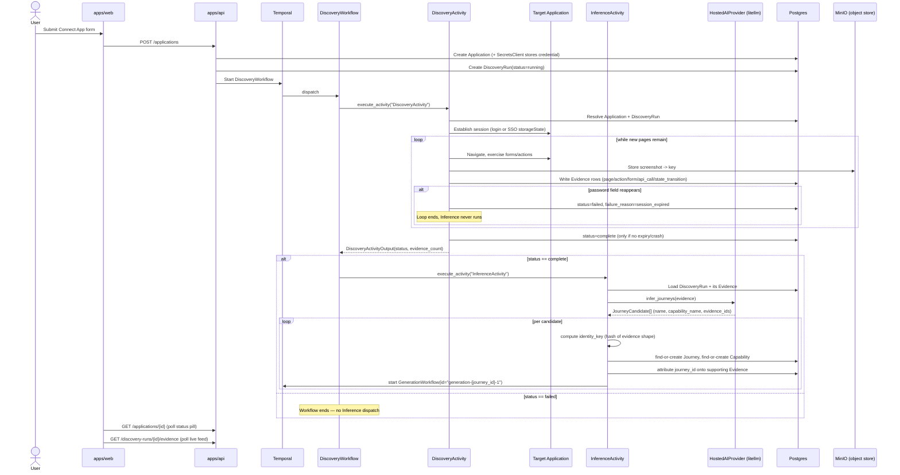

# 🔎 Epic 2 — The Discovery Pipeline (Stories 2.1–2.5)

> **Companion to `DEVELOPER_GUIDE.md`.** That doc is the general onboarding
> path (bring the stack up, sign in, connect an Application). This doc is a
> deep dive into *what happens after* an Application is connected — the fully
> autonomous pipeline that turns a live URL and some credentials into
> AI-inferred candidate Journeys, ready for test generation, with no human
> step in between.

| | |
|---|---|
| **Epic** | Epic 2 — Autonomous Discovery |
| **Stories** | 2.1 Start a Discovery Run · 2.2 Autonomous Exploration Captures Evidence · 2.3 Discovery Completion · 2.4 Session Expiry Handling · 2.5 AI Journey/Capability Inference |
| **Status as of writing** | All five stories implemented, tested, at `review` status (see `sprint-status.yaml`) |
| **Depends on** | Epic 1 (sign-in, Organization scoping, Application onboarding with credentials via `SecretsClient`) |
| **Feeds into** | Epic 3 (Review Queue — rename/delete curation of the Journeys this epic produces), Epic 4 (Generation — the `GenerationWorkflow` this epic starts) |

---

## 📑 Table of contents

1. [Epic 2 in one paragraph](#-epic-2-in-one-paragraph)
2. [Story-by-story breakdown](#-story-by-story-breakdown)
3. [Architecture rules this epic lives inside](#-architecture-rules-this-epic-lives-inside)
4. [End-to-end execution flow](#-end-to-end-execution-flow)
5. [Domain model reference](#-domain-model-reference)
6. [API reference](#-api-reference)
7. [Component responsibilities](#-component-responsibilities)
8. [Database migrations](#-database-migrations)
9. [Files added/modified per story](#-files-addedmodified-per-story)
10. [Known gaps and accepted limitations](#-known-gaps-and-accepted-limitations)

---

## 🧠 Epic 2 in one paragraph

Story 1.3 already made "connect an Application" also *start* a Discovery Run,
in the same request — no separate "begin discovery" button exists anywhere in
the product. Epic 2 is everything that happens after that point, unattended:
a real headless browser signs into the target Application, crawls it
exhaustively, and records every page/action/form/API call it finds as raw
**Evidence**. Once nothing new is left to find, an AI call groups that
Evidence into business-language **Journeys** (grouped under **Capabilities**),
and — with no human approval step — immediately kicks off the (currently
still-a-stub) generation pipeline for each one. If the crawl's session drops
partway through, that's handled as a distinct, clearly-surfaced failure
rather than a silently-incomplete result. By the end of Epic 2, an Application
goes from "just connected" to "has a reviewable set of candidate Journeys"
with nobody touching anything in between.

---

## 📖 Story-by-story breakdown

### Story 2.1 — Start a Discovery Run

**Goal:** the instant Story 1.3's Connect App form submits, a `DiscoveryRun`
row exists and a Temporal workflow is actually running for it.

**What was built:**
- `DiscoveryRun` domain entity already existed from Story 1.3 (it had been
  built ahead of schedule) — verified it already matched this story's needs
  (`status` defaulting to `"running"`, UUIDv7/UUIDv4 id split), no changes.
- `DiscoveryWorkflow` (in `packages/workflows`) went from a trivial no-op
  shell to actually dispatching a `DiscoveryActivity` by registered name —
  the workflow itself contains zero I/O, per AD-2.
- `DiscoveryActivity` itself was still a **stub** at the end of this story —
  it just proved the dispatch path end-to-end (API → Temporal → worker →
  Activity) and returned a placeholder string. Real crawling was explicitly
  out of scope here.
- The `DiscoveryRun`-creation + workflow-start logic was extracted out of the
  `POST /applications` endpoint into its own function,
  `apps/api/src/api/discovery.py::start_discovery_run`, called directly by
  Story 1.3's onboarding endpoint in the same request (no separate "start
  discovery" route exists).
- Frontend: a `StatusPill` component (Running, signal-teal, pulsing dot) was
  added to the Discover Journeys screen — **not** a separate "Discovery
  Progress" screen. The story's own task list assumed a distinct Discovery
  Progress screen might exist; the actual current UX spine (`EXPERIENCE.md`,
  updated the same day the story was written) confirmed the IA has exactly
  4 pipeline screens with no such screen, so the status pill was placed on
  Discover Journeys instead — a judgment call resolving the story's own
  flagged `[GAP]` against the more authoritative, more recent UX docs.

**Connects to:** built directly on Epic 1's Application onboarding and
Temporal wiring (Story 1.1). Sets up the workflow/activity dispatch shape
every later story in this epic extends.

---

### Story 2.2 — Autonomous Exploration Captures Evidence

**Goal:** replace Story 2.1's stub with a real headless-browser crawl that
captures everything it finds as structured `Evidence`.

**What was built:**
- **`Evidence` domain entity** (new): `discovery_run_id` (immutable FK),
  `type` (`page | action | form | api_call | state_transition`), `details`
  (JSONB — structured per-type metadata), `object_storage_key` (nullable —
  binary artifacts live outside Postgres), `journey_id` (nullable, left
  **null** here on purpose — Story 2.5 is the only writer of it).
- **Object storage abstraction** (`apps/workers/discovery/.../object_store.py`):
  a small `put(bytes) -> key` / `get(key) -> bytes` wrapper around **MinIO**,
  added as a new permanent service in `docker-compose.yml` (ports 9000/9001).
  No formal architectural port exists for this (unlike `AIProvider`/
  `SecretsClient`) — the architecture only fixes the *shape* (structured
  metadata in Postgres, binaries by object-storage key) and defers the
  provider choice; MinIO is this build's concrete, swappable-later adapter.
- **The real crawl loop** (`crawler.py`): breadth-first same-origin link
  traversal, generic placeholder values for form fields keyed by input type,
  `page.on("response")` interception for XHR/fetch calls, and best-effort
  standalone-button clicks. Every page visit takes a screenshot (→ object
  store) and logs `page` Evidence; forms and buttons log `form`/`action`
  Evidence and, if they navigate, a `state_transition` entry too.
- **Session establishment** (`session.py`): for `standard_login`, navigate to
  the Application and drive whatever login form is found there (heuristic:
  a page with a password input); for `sso_session_reuse`, the resolved secret
  *is* a Playwright `storageState` JSON blob, loaded directly via
  `browser.new_context(storage_state=...)` — no login step at all.
- **Discovery Progress live-feed**: `GET /discovery-runs/{id}/evidence`
  (Organization-scoped, newest-50), polled every 1.5s by a new
  `EvidenceLiveFeed` component, rendered in monospace (the standing
  "raw-evidence-only" typography rule).
- A **test-only placeholder stopping cap** (`MAX_ITERATIONS`) was added so
  the crawl loop was boundable for testing — explicitly *not* the real FR-7
  stop condition; Story 2.3's job.

**Connects to:** replaces Story 2.1's `DiscoveryActivity` stub with its real
body; the `Evidence` rows this story writes are exactly what Story 2.5's
`InferenceActivity` later reads. The placeholder stop condition is what
Story 2.3 replaces.

---

### Story 2.3 — Discovery Completion

**Goal:** stop treating "ran out of test iterations" as the finish line —
implement the real FR-7 rule (exhaustive traversal) and make `complete` a
first-class, directly-queryable status.

**What was built:**
- Removed `MAX_ITERATIONS` entirely — the crawl loop now runs
  `while page_queue:` with **no cap at all**. The queue emptying (no new
  same-origin page left to visit) *is* the exhaustive-traversal signal,
  since forms/actions on each page are already exhausted in the same pass.
  This is a deliberate accepted risk (PRD §12): an Application with infinite
  pagination could run indefinitely — no safety net was added, by explicit
  product decision.
- `DiscoveryActivity` now writes `DiscoveryRun.status = "complete"` once the
  crawl loop returns normally — the one and only place that value is set.
- Audited every completeness read-path (the two API endpoints, the frontend)
  to confirm none of them ever infer completeness from Evidence row counts
  or elapsed time — all read `DiscoveryRun.status` directly (AD-10).
- `StatusPill` gained a `Complete` (green, `--good`/`--good-wash`) variant,
  pulsing dot suppressed — `DESIGN.md` never named this variant explicitly,
  so it was filled in per the design system's own semantic-color rule.

**Connects to:** edits the exact same `DiscoveryActivity` loop Story 2.2
built (not a parallel mechanism). Sets the terminal `complete` state that
Story 2.5's `DiscoveryWorkflow` branches on to decide whether to run
Inference at all.

---

### Story 2.4 — Session Expiry Handling

**Goal:** a Discovery Run whose session drops mid-crawl must fail
*distinctly* — never look like a small-but-normal finished result.

**What was built:**
- `DiscoveryRun.failure_reason` (nullable) added — meaningful only when
  `status="failed"`; `session_expired` is the one value the architecture
  names explicitly.
- **Detection heuristic — a deliberate deviation from the story's own
  suggestion.** The story suggested matching against the captured login
  URL; that doesn't work for a single-URL app shell where the same route
  serves both the login form and the authenticated view depending on
  session state (a realistic real-world pattern). Instead, the crawl loop
  checks for a reappearing `input[type="password"]` on any page visited
  mid-crawl — the same primitive `session.py`'s login heuristic already
  uses, so "are we logged in" is checked consistently in both places.
- This check runs **before** the exhaustive-traversal continuation each
  iteration, and short-circuits it: on detection, the loop returns
  immediately with `session_expired=True` (evidence captured so far is
  still preserved and written) — `DiscoveryActivity` then writes
  `status="failed"`, `failure_reason="session_expired"`, a structurally
  distinct code path from Story 2.3's `complete` write (AD-11's whole point).
- **Catch-all crash handling**: the entire Activity body (including secret
  resolution, which previously could crash *outside* any handler) is now
  wrapped in `try`/`except Exception`, setting `status="failed"` with
  `failure_reason=None` for anything that isn't session expiry — ensuring a
  crash never leaves a run stuck showing `running` forever.
- Frontend: a re-authentication prompt ("Session expired mid-crawl.
  Re-authenticate to continue discovery.") shown only for
  `failed`+`session_expired`; any other `failed` cause shows a generic
  message. `StatusPill` gained a `Failed` (red, `--danger`/`--danger-wash`)
  variant.

**Connects to:** extends the same per-iteration check Story 2.3 added
(session-expiry is checked *before* the exhaustive-traversal check, per the
architecture's requirement that it "win" the race). `ApplicationRead` gained
`discovery_failure_reason` so the frontend can tell the two failure causes
apart.

---

### Story 2.5 — AI Journey/Capability Inference from Evidence

**Goal:** turn a `complete` run's raw Evidence into candidate Journeys a
human can actually review, and get generation started with zero approval
gate.

**What was built:**
- **`Journey`** entity (new): `discovery_run_id` (FK, **immutable** — enforced
  via a SQLAlchemy `@validates` check that raises if reassigned after the
  row is persistent, not just documented), `capability_id` (nullable FK),
  `status` (`candidate | deleted`), `name` (business-language), `identity_key`
  (deterministic fingerprint), `attempt` (starts at `1`).
- **`Capability`** entity (new): `application_id` FK, same `status` shape,
  `name`, `description`.
- **`HostedAIProvider`** (`packages/ai_provider`) — the first real
  `AIProvider` adapter, backed by **litellm** (not a direct vendor SDK),
  model configurable via `AI_MODEL` env var (default
  `anthropic/claude-sonnet-5`, requires `ANTHROPIC_API_KEY`). Prompts the
  model with an indexed Evidence listing, asks for a JSON object grouping
  indices into named Journeys + Capabilities, then maps indices back to real
  `Evidence.external_id`s.
- **`InferenceActivity`** (new, alongside `DiscoveryActivity`): fetches a
  `DiscoveryRun`'s Evidence, calls `HostedAIProvider.infer_journeys(...)`,
  then per candidate — computes `identity_key` (sha256 over the *sorted*
  JSON-serialized `details` of exactly the supporting Evidence, **never**
  the AI's name — AD-13), finds-or-creates the `Journey` (scoped to the
  Application, so identity_key collisions across different Applications
  never merge), finds-or-creates the `Capability` by name, attributes
  `journey_id` onto the supporting Evidence rows, and starts an independent
  `GenerationWorkflow(id="generation-{journey_id}-1")` — catching
  `WorkflowAlreadyStartedError` so a retry is naturally idempotent (AD-9).
- **`DiscoveryWorkflow` extended**: after `DiscoveryActivity` returns, the
  workflow checks the result's `status`; only `"complete"` triggers the
  `InferenceActivity` dispatch — `"failed"` ends the workflow with nothing
  further (a failed run has no reliable evidence to infer from).

**Connects to:** reads exactly the `Evidence` rows Story 2.2 wrote and the
`complete` status Story 2.3 introduced; is skipped entirely on the `failed`
path Story 2.4 introduced. Everything downstream (Epic 3's Review Queue,
Epic 4's real generation body) reads the `Journey`/`Capability` rows this
story is the sole writer of.

> **A real bug caught during this story, worth knowing about:** changing an
> Activity's return type from a bare `str` to a dataclass
> (`DiscoveryActivityOutput`) without also passing
> `result_type=DiscoveryActivityOutput` to `workflow.execute_activity(...)`
> causes the workflow to **hang indefinitely** — activities dispatched by
> name string (not function reference) don't get automatic result-type
> inference, so the workflow's attribute access on the result silently fails
> and Temporal retries the workflow task forever. Any future Activity whose
> return type isn't a bare primitive needs this kwarg.

---

## 🏛 Architecture rules this epic lives inside

These aren't Epic-2-specific — they're project-wide invariants Epic 2 had to
build inside, same as every other epic:

| Rule | What it means for Epic 2 |
|---|---|
| **AD-1** — bounded workflows | `DiscoveryWorkflow` runs Discovery + (conditionally) Inference and terminates — it doesn't wait around for human review. `GenerationWorkflow` per candidate is independent and short-lived. |
| **AD-2** — workflows orchestrate only | `DiscoveryWorkflow` contains **zero** I/O — no DB, no network, no Playwright. Every real action (crawling, Vault reads, Postgres writes, the AI call, starting `GenerationWorkflow`) happens inside an Activity, in `apps/workers/discovery`. |
| **AD-3** — one `AIProvider` port | `InferenceActivity` never imports `litellm` — only `HostedAIProvider` (inside `packages/ai_provider`) does. Swapping model/vendor is a config change (`AI_MODEL` env var), not a code change. |
| **AD-5** — `SecretsClient` only | `DiscoveryActivity` resolves the Application's stored credential via `VaultSecretsClient().resolve(...)` — never a raw DB column. |
| **AD-8** — evidence pointer, right granularity | `Evidence.discovery_run_id` is set at capture time by Discovery; `Evidence.journey_id` is set later, only by Inference. `Journey.discovery_run_id` is immutable once set. |
| **AD-9** — idempotent side effects | `InferenceActivity`'s candidate-creation is keyed by `identity_key`; `GenerationWorkflow`'s deterministic ID plus Temporal's duplicate-ID rejection makes a retry safe. |
| **AD-10** — completeness is a first-class status | `DiscoveryRun.status` is read directly everywhere (API responses, frontend) — never inferred from Evidence counts or timing. |
| **AD-11** — session expiry is a named failure | `failed`+`session_expired` is structurally distinct from `complete`, never conflated. |
| **AD-12** — Organization scoping | `GET /discovery-runs/{id}/evidence` joins through `Application.organization_id` before returning anything — same central mechanism every other endpoint uses. |
| **AD-13** — `identity_key` from evidence, not AI naming | Computed independent of the AI's chosen `name`, so re-discovery dedup (a later story) has something stable to compare against. |
| **UUIDv7-internal/UUIDv4-external** | Every new entity (`Evidence`, `Journey`, `Capability`) follows the same split `Application` established in Story 1.3 — internal PK never leaves the backend. |

---

## 🔄 End-to-end execution flow



**In prose, the same flow:**

1. User submits the Connect App form → `POST /applications`.
2. `apps/api` creates the `Application` row, writes credentials via
   `SecretsClient`, creates a `DiscoveryRun(status="running")`, and starts
   `DiscoveryWorkflow` — all in the same request (Story 1.3/2.1).
3. `DiscoveryWorkflow` (zero I/O) dispatches `DiscoveryActivity`.
4. `DiscoveryActivity` resolves the Application's credential, establishes a
   browser session (login form or SSO `storageState`), and crawls
   breadth-first until no new page is found — writing `Evidence` rows and
   screenshots (→ MinIO) as it goes (Story 2.2).
5. If a password field reappears mid-crawl, the run stops immediately with
   `failed`/`session_expired` (Story 2.4); any other crash also ends in
   `failed` with no reason. Otherwise, exhausting the queue writes
   `complete` (Story 2.3).
6. `DiscoveryWorkflow` reads the Activity's result: only on `complete` does
   it dispatch `InferenceActivity` (Story 2.5).
7. `InferenceActivity` calls `HostedAIProvider` (litellm) with the run's
   Evidence, gets back candidate groupings, computes a stable `identity_key`
   per candidate, writes `Journey`/`Capability` rows, attributes `journey_id`
   back onto the Evidence, and starts a `GenerationWorkflow` per candidate —
   no human approval step anywhere in this chain.
8. Meanwhile, the frontend (Discover Journeys screen) polls
   `GET /applications/{id}` for the status pill and
   `GET /discovery-runs/{id}/evidence` for the live feed, both reading
   `DiscoveryRun.status`/`failure_reason` directly.

---

## 🗂 Domain model reference

| Entity | Added in | Key fields | Invariants |
|---|---|---|---|
| `DiscoveryRun` | 1.3, extended 2.3/2.4 | `application_id`, `status` (`running\|complete\|failed`), `failure_reason` (nullable) | `status` set exactly 3 places total: `running` at creation, `complete`/`failed` only by `DiscoveryActivity`. Never inferred elsewhere (AD-10). |
| `Evidence` | 2.2, FK completed 2.5 | `discovery_run_id` (immutable), `journey_id` (nullable), `type`, `details` (JSONB), `object_storage_key` | `discovery_run_id` set by Discovery only; `journey_id` set by Inference only (AD-8). Binaries never stored inline (AD-8). |
| `Journey` | 2.5 | `discovery_run_id` (immutable, enforced), `capability_id`, `status` (`candidate\|deleted`), `name`, `identity_key`, `attempt` | `identity_key` computed from evidence shape, never AI-chosen `name` (AD-13). No `approved`/`rejected` — every non-`deleted` row is trusted immediately (FR-14). |
| `Capability` | 2.5 | `application_id`, `status`, `name`, `description` | Same status shape as `Journey`; deduped by `(application_id, name)` within an Inference run. |

---

## 🔌 API reference

| Endpoint | Method | Added/changed in | Purpose |
|---|---|---|---|
| `/applications` | `POST` | 1.3, extended 2.1 | Creates Application + starts the whole pipeline (calls `api/discovery.py::start_discovery_run`). |
| `/applications/{external_id}` | `GET` | 1.3, extended 2.1–2.4 | Returns `ApplicationRead` including `discovery_status` and (2.4) `discovery_failure_reason` — what the status pill polls. |
| `/discovery-runs/{external_id}/evidence` | `GET` | 2.2 | Organization-scoped, newest-50 `Evidence` rows — what the live feed polls. |

None of these are new *routes* beyond what Story 1.3 already established for
`/applications` — Epic 2 only added the evidence-feed endpoint and extended
the existing response models.

---

## 🧩 Component responsibilities

| Component | Lives in | Responsibility |
|---|---|---|
| **API service** | `apps/api` | Application onboarding, starts the workflow, serves status/evidence reads. No crawling, no AI calls, no direct Playwright/litellm imports. |
| **DiscoveryWorkflow** | `packages/workflows` | Pure orchestration (AD-2): dispatches `DiscoveryActivity`, then conditionally `InferenceActivity`. Zero I/O. |
| **DiscoveryActivity** | `apps/workers/discovery` | All Discovery I/O: Vault resolve, Playwright crawl, Postgres writes, MinIO writes, status/failure_reason writes. |
| **Crawler** (`crawler.py`) | `apps/workers/discovery` | The actual BFS traversal logic, form-filling, API-call interception, session-expiry content check — separated from the Activity's DB/orchestration glue. |
| **Session** (`session.py`) | `apps/workers/discovery` | Establishes the authenticated `BrowserContext` before crawling (login heuristic or SSO storage-state reuse). |
| **Object store** (`object_store.py`) | `apps/workers/discovery` | MinIO put/get for screenshots — the only place binary data touches storage. |
| **InferenceActivity** | `apps/workers/discovery` | All Inference I/O: calls `HostedAIProvider`, Postgres writes for Journey/Capability/Evidence attribution, starts `GenerationWorkflow` via its own Temporal client. |
| **HostedAIProvider** | `packages/ai_provider` | The only module allowed to import `litellm`. Prompt construction, response parsing, mapping back to real Evidence ids. |
| **Frontend** | `apps/web` | Polls status + evidence-feed endpoints; renders `StatusPill` (running/complete/failed) and `EvidenceLiveFeed`; shows the re-authentication prompt on `session_expired`. |
| **MinIO** | `docker-compose.yml` | Local-dev S3-compatible object store — a real permanent dependency now, not a throwaway. |

---

## 🗄 Database migrations

Applied in this order (linear chain, no branches):

```
3206b535a942  (Epic 1 baseline)
    ↓
c6483d9f0418  add auth_method to application         (Story 1.4)
    ↓
6c1645fa421a  add evidence entity                     (Story 2.2)
    ↓
a8cdc83f6451  add failure_reason to discovery_run      (Story 2.4)
    ↓
fc7fe4561f07  add journey and capability entities      (Story 2.5)
```

Two things worth knowing about `fc7fe4561f07`:
- It's the migration that finally adds the **foreign key** on
  `evidence.journey_id` — that column existed since Story 2.2's migration as
  a bare, unconstrained `UUID` column, because the `journey` table it points
  to didn't exist yet. This is normal incremental schema evolution, not a
  mistake: add the column, add the FK once the target table exists.
- The downgrade needed an explicitly-named constraint
  (`fk_evidence_journey_id_journey`) — Alembic's autogenerated
  `op.drop_constraint(None, ...)` doesn't resolve a real constraint name
  without a naming convention configured.

---

## 📁 Files added/modified per story

**Story 2.1:**
`packages/workflows/src/workflows/discovery_workflow.py` (new dispatch),
`apps/api/src/api/discovery.py` (new — extracted `start_discovery_run`),
`apps/api/src/api/main.py` (calls it), `apps/web/.../StatusPill.tsx` (new),
`apps/web/.../DiscoverJourneysPlaceholder.tsx` (wired in).

**Story 2.2:**
`packages/domain/src/domain/evidence.py` (new), migration `6c1645fa421a`,
`docker-compose.yml` (+ MinIO service),
`apps/workers/discovery/src/discovery_worker/{crawler,session,object_store,db}.py`
(all new), `activities.py` (real `discovery_activity`),
`apps/api/src/api/main.py` (+evidence endpoint),
`apps/web/.../EvidenceLiveFeed.tsx` (new).

**Story 2.3:**
`crawler.py` (removed iteration cap), `activities.py` (writes `complete`),
`StatusPill.tsx` (+ green variant).

**Story 2.4:**
`packages/domain/src/domain/discovery_run.py` (+`failure_reason`), migration
`a8cdc83f6451`, `crawler.py` (+expiry detection), `activities.py` (+failure
branching), `StatusPill.tsx` (+ red variant),
`DiscoverJourneysPlaceholder.tsx` (+ re-auth prompt), `main.py`
(+`discovery_failure_reason`).

**Story 2.5:**
`packages/domain/src/domain/{journey,capability}.py` (new), `evidence.py`
(+FK), migration `fc7fe4561f07`,
`packages/ai_provider/src/ai_provider/{hosted,journey_candidate}.py` (new),
`__init__.py` (real `infer_journeys` signature),
`packages/workflows/src/workflows/discovery_workflow.py` (+ conditional
Inference dispatch), `apps/workers/discovery/src/discovery_worker/
{identity_key,temporal_client}.py` (new), `activities.py`
(+`inference_activity`), `worker.py` (registers it).

Every story's story file (`_bmad-output/implementation-artifacts/2-*.md`)
has the exhaustive, file-by-file "File List" in its Dev Agent Record section
if you need line-level detail beyond this summary.

---

## ⚠️ Known gaps and accepted limitations

- **No safety cap on the crawl loop** — an Application with unbounded
  pagination or similar could run indefinitely. This is an explicit,
  accepted product risk (PRD §12, item 7), not an oversight.
- **No real LLM call verified live in this environment** — no
  `ANTHROPIC_API_KEY` is provisioned here, so `HostedAIProvider`'s actual
  network call is skip-cleanly tested (matching this repo's existing
  convention for external dependencies) rather than run live.
  `InferenceActivity`'s own logic (grouping, `identity_key`, attribution,
  `GenerationWorkflow` starts) is fully tested against real Postgres and
  Temporal with a fake `AIProvider` standing in for the network call.
- **`GenerationWorkflow`'s body is still a no-op stub** — Story 2.5 only
  needed to *start* it with the right ID; growing it into real Scenario/
  Playwright generation is Epic 4's job.
- **Traversal algorithm and session-expiry heuristic are both
  "sound, non-binding defaults"** — neither the PRD nor the architecture
  spine prescribes an exact crawl algorithm or expiry-detection mechanism;
  both were explicitly flagged as genuine gaps to fill with reasonable
  judgment, not oversights to "fix" later.
- **Capability dedup is per-Inference-run/per-Application only** — the full
  re-discovery dedup story (3.5, using `identity_key`) isn't built yet.
