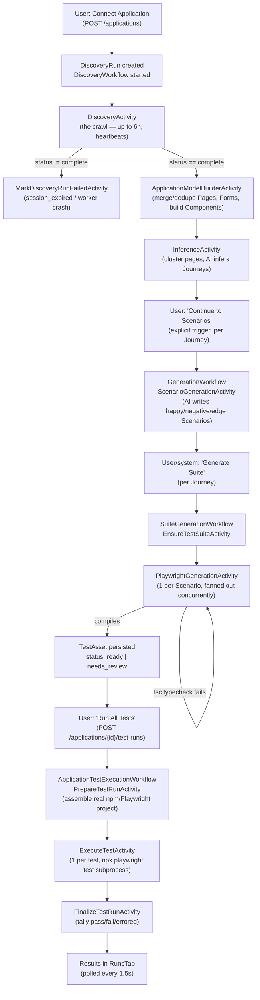
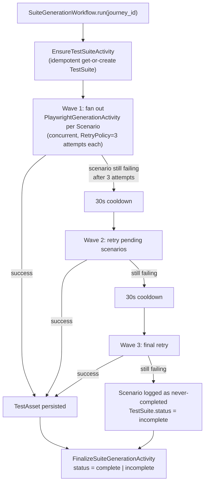
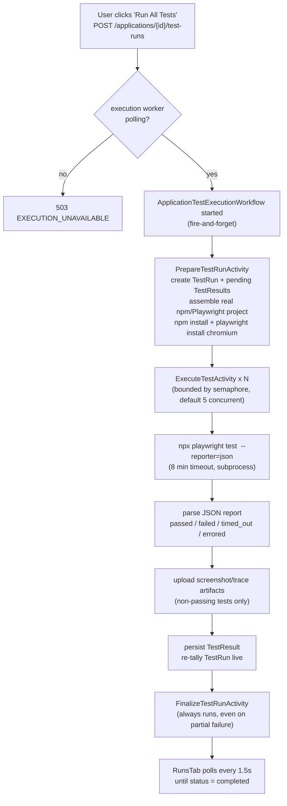

# AITestGen — the real pipeline, end to end

> **Why this doc exists.** `docs/DEVELOPER_GUIDE.md` describes Discovery as a
> "no-op shell" and Generation as a "no-op stub" — that was true at Stories
> 1.1–1.3 and is no longer true. Everything below was read directly from the
> current code (not `_bmad/`, `_bmad-output/`, or any other planning doc,
> which are stale by project convention — see root `CLAUDE.md`). Every claim
> below cites a `file:line`. If a later change makes a line stale, trust the
> code over this doc and fix this doc in the same PR.
>
> Four stages, three Temporal workers: **Discovery** (crawl the app) →
> **Generation** (Journeys → Scenarios → Playwright specs) → **Execution**
> (run the specs, surface results). Two independent retry mechanisms make
> the middle two stages self-healing under real load — see
> [Resilience patterns](#resilience-patterns-worth-understanding-once) below,
> it explains a failure mode that otherwise looks like a stuck suite.

---

## 1. The whole thing, in one picture

| Stage | Temporal workflow | Worker | Where the AI is called |
|---|---|---|---|
| Discovery / crawl | `DiscoveryWorkflow` | `apps/workers/discovery` | Only for ambiguous state-identity tiebreaks (evidence-only, never authoritative) |
| Journey inference | `DiscoveryWorkflow` (`InferenceActivity`) | `apps/workers/discovery` | `HostedAIProvider.infer_journeys` |
| Scenario generation | `GenerationWorkflow` | `apps/workers/generation` | `HostedAIProvider.generate_scenarios` |
| Playwright generation | `SuiteGenerationWorkflow` | `apps/workers/generation` | `HostedAIProvider.generate_playwright` |
| Execution | `ApplicationTestExecutionWorkflow` | `apps/workers/execution` | none — runs the already-generated spec as a real subprocess |

---

## 2. Discovery / crawl

**What it's for:** turn a base URL + credentials into a structured model of
the application — real `Page`, `Form`, `FormField`, `Action`, `ApiEndpoint`,
`PageTransition` rows — by actually driving headless Chromium through it.

### Walkthrough

1. **Trigger.** `POST /applications` (`apps/api/src/api/main.py:486-535`)
   validates the URL is reachable, stores credentials via `VaultSecretsClient`
   (only the opaque `SecretRef` ever touches Postgres), creates the
   `Application` row, and — in the *same request* — starts discovery. There
   is no separate "click to start crawling" step.
2. **Run + workflow start.** `apps/api/src/api/discovery.py:22-64` first
   checks a discovery worker is actually polling `discovery-task-queue`
   (`has_pollers`) — if not, the run is written straight to
   `status="failed", failure_reason="worker_unavailable"` instead of hanging
   at `running` forever. Otherwise it creates
   `DiscoveryRun(status="running", stage="initializing")` and starts
   `DiscoveryWorkflow.run`.
3. **Orchestration** (`packages/workflows/src/workflows/discovery_workflow.py:86-159`)
   runs three activities strictly in sequence, each gated on the last:
   - `DiscoveryActivity` — `start_to_close_timeout=6h`, `heartbeat_timeout=2m`.
     Deliberately generous: there is **no iteration cap by design (AD-10)** —
     only a heartbeat distinguishes "still crawling a big site" from "worker
     died".
   - If the result isn't `status="complete"` (i.e. `failed` or
     `session_expired`), the workflow stops here — analysis never runs.
   - `ApplicationModelBuilderActivity` (10 min timeout), then
     `InferenceActivity` (5 min timeout, `RetryPolicy(maximum_attempts=3)` —
     the first *bounded* retry policy in the codebase, because unbounded
     retries against a paid LLM would be a real cost risk). A failure here
     runs `MarkDiscoveryRunFailedActivity` so the frontend's "Analyzing…"
     spinner can't hang forever.
4. **Session setup**
   (`apps/workers/discovery/src/discovery_worker/activities.py:317-1009`)
   resolves the Vault credential, seeds the in-process `StateIdentityCache`
   from any prior canonical `Page` rows, seeds a resume frontier if this is
   an explicit resume or a Temporal-retried attempt
   (`attempt > 1` — two different signals, don't conflate them), seeds the
   Test Data Pool, then launches headless Chromium and logs in
   (`discovery_worker/session.py`): `standard_login` fills a real form;
   `sso_session_reuse` replays a stored Playwright `storageState` blob with
   no login step at all.
5. **The crawl loop** (`crawler.py:3035-3623`) is a plain BFS over a page
   queue, keyed by a fingerprint that strips empty fragments and one-time
   OAuth callback params but **keeps non-empty hash fragments** — hash-routed
   SPAs need one graph node per `#/route`, not one node total. Per page it:
   retries a 5xx navigation, waits for the page to actually be ready (network
   quiet + DOM stable + content present), screenshots it, detects a
   session-expiry redirect and silently re-logs-in (bounded attempts, else
   the run ends `session_expired`), scrapes links, samples infinite-scroll
   regions (bounded), fills and submits every form, clicks every
   distinctly-labeled button once (representative-action sampling, not one
   click per DOM instance), and explores tabs / same-origin iframes (depth 3)
   / open shadow DOM. The **only** stop conditions are `max_pages`,
   `max_discovery_duration_seconds` (now nullable = unlimited, see this
   branch's migration), or the queue running dry.
6. **Safety classification**, per clickable candidate
   (`planner.decide` → `safety_engine.evaluate` →
   `packages/safety_classifier/classify.py`): three regex verb lists against
   the accessible name. `DESTRUCTIVE` (delete/remove/terminate/transfer/pay)
   always blocks, full stop. `SAFE` (view/open/search/filter/…) always
   executes. Everything else — **including an unmatched label** — is
   `AMBIGUOUS`, resolved by `Application.safety_posture`:
   `production` → deferred (written as a `BlockedTask` for later human
   review), `non_production` (default) → executes. Note the live-crawl
   verdict vocabulary is `SAFE / DESTRUCTIVE / DEFER` — `UNKNOWN` only shows
   up later, in Scenario-time classification (§3).
7. **State identity** (`state_identity.py`) decides whether a newly-reached
   page is the `SAME` state as one already captured, a `VARIANT` (a real
   sibling row — never silently merged), or genuinely `NEW`, via a weighted
   composite score (heading match, action-name overlap, form-field overlap,
   structural tokens). The ambiguous middle band gets an AI tiebreaker call
   that is evidence-only and can never flip the verdict.
8. **Persistence** is buffered per page and flushed as typed rows once a page
   is fully processed; one bad insert rolls back and the crawl continues
   rather than poisoning the whole run.
9. **Model building** (`model_builder.py`) then merges duplicate
   `Page`/`Form`/`ApiEndpoint` rows across *every* prior run for this
   Application (oldest UUIDv7 wins as canonical, everything else gets
   `merged_into_id` set), dedupes transitions, and derives ranked, durability-
   scored `Component`/`ComponentLocator` rows — these locators are what
   generation later treats as ground truth over anything the LLM invents.
10. **Journey inference** (`InferenceActivity`,
    `activities.py:1074-1329`) clusters canonical pages into
    navigation-connected groups (free, no AI — union-find over
    `PageTransition`), bin-packs them into ≤150-page batches, and calls
    `HostedAIProvider.infer_journeys` per batch. Two hallucination guards run
    client-side: a candidate whose name looks like a raw route is dropped
    entirely, and a step pointing at a page outside the batch is dropped
    individually. Journeys are deduped by an `identity_key` derived from the
    *actual shape* of their supporting pages/components/endpoints — never
    from the AI's name or step order, since those vary run to run. A per-run
    cap (`max_journeys`, default 50) silently drops any excess.
    `GenerationWorkflow` is **not** auto-started here — it fires later from
    an explicit "Continue to Scenarios" click, once per Journey.

### Gotchas

- No iteration cap anywhere by design — only page count, duration (now
  unbounded by default), or queue exhaustion stop a crawl.
- Logout links are regex-filtered out so the crawler never self-inflicts a
  mid-crawl logout.
- Mid-crawl session expiry isn't treated as automatically fatal — it's
  detected as "redirected away from the URL we asked for, and a password
  field appeared," and short-lived-token apps get a bounded silent re-login
  instead of failing the whole run.
- `variant_of_page_id` (distinct live sibling state) and `merged_into_id`
  (superseded duplicate) on `Page` mean opposite things — easy to swap when
  reading the schema.
- `consult_ai` exists in `safety_engine.py`, is tested, but is **not wired
  into the live crawl loop** — dead code from the crawl's own perspective
  today (flagged with a `ponytail:` comment at the definition).

---

## 3. Journey → Scenario generation

**What it's for:** turn each Journey (an ordered walk through captured pages)
into 3 scenario types — happy / negative / edge — with resolved test data,
each one a candidate for a Playwright spec.

### Walkthrough

1. **Trigger.** A user clicks "Continue to Scenarios" for one Journey →
   `GenerationWorkflow.run(journey_id)`
   (`packages/workflows/src/workflows/generation_workflow.py:27-39`) — a
   one-line dispatch to `ScenarioGenerationActivity`
   (5 min timeout, `RetryPolicy(maximum_attempts=3)`).
2. **Idempotency.** `scenario_generation_activity`
   (`apps/workers/generation/src/generation_worker/activities.py:322-492`)
   returns existing Scenarios untouched if any already exist for
   `(journey_id, generation_run_id)` — a Temporal at-least-once retry never
   double-generates.
3. **Context assembly.** Walks `JourneyStep → Component/Page →
   Form/FormField/ValidationRule/ApiEndpoint` into an ordered list of pages
   (with forms/endpoints attached as transient attributes — never persisted,
   just scaffolding for the prompt).
4. **AI call, per scenario type.**
   `HostedAIProvider.generate_scenarios` (`packages/ai_provider/src/ai_provider/hosted.py:809-885`)
   makes **one call per type** (happy/negative/edge), not one call total.
   A failed type is logged and skipped (fault isolation) — only if *every*
   type fails does the activity raise, giving Temporal's retry something
   real to act on. **Gotcha:** a Journey can silently end up with fewer
   Scenarios than expected if exactly one type's call failed; nothing
   surfaces that as an error.
5. **Persistence guardrails**, on every returned candidate:
   - `test_data` values start `None` — a reviewer fills them in later via the
     API, never the AI.
   - Any test-data field naming the account's *own* existing login
     credential is stripped outright (`_is_existing_credential_field`) — a
     deterministic backstop, because the prompt-level "don't do this" rule
     alone wasn't fully reliable in practice.
   - `safety_classification` (`SAFE`/`DESTRUCTIVE`/`UNKNOWN`) is computed
     from the plain-language steps via the same `classify()` verb-list logic
     the live crawl uses — but this is generation-time metadata only; see
     §5 for why it currently has **no effect** at execution time.

### Default test-data value resolution

Runs later, inside Playwright generation (`_resolve_scenario_defaults_sync`,
`activities.py:902-975`), for any field still blank or still holding one of
this generator's own known placeholder literals (so a field auto-defaulted by
an older, less-refined pass is eligible to be redone — but anything a
reviewer actually typed is never touched):

1. **Scenario-intent-driven** — if the Scenario's own name/steps (or the
   field's own name) name a specific data property (Unicode, emoji, markup,
   a numeric/length boundary, a password character-set boundary), a matching
   deterministic literal is used, e.g. `"Pässwörd123$"` for a Unicode-password
   scenario.
2. **Generic fallback** — password/card/email name patterns, then the
   field's real captured HTML `input_type` (`field_input_types_for_page`,
   `spec_linter.py:280-293`), then a quantity-name regex, else `"Test
   value"`. Values are kept distinct across sibling fields on the same form —
   needed for "X and Y must differ" (mismatched-confirmation) scenarios.

This is also where the numeric-typing fix from this same investigation lives:
`field_input_types` (real captured `input_type`, e.g. `"number"`) now flows
all the way into the Playwright-generation prompt so the LLM declares a
correctly-typed constant once, instead of only being told "don't do this" —
see §4 and the git history around `hosted.py`'s "Numeric-argument rule" for
the full reasoning.

---

## 4. Scenario → Playwright spec generation

**What it's for:** convert one Scenario into one compiled, ground-truth-
checked Playwright `TestAsset`.

### Walkthrough

1. **`EnsureTestSuiteActivity`** — idempotent insert-or-fetch of the
   `TestSuite` row keyed on `(journey_id, generation_run_id)`. On genuine
   creation it atomically supersedes the prior `current=True` TestSuite and
   its TestAssets in the same transaction.
2. **Per-Scenario fan-out**: `PlaywrightGenerationActivity`, once per
   Scenario, concurrently. Inside each call
   (`activities.py:607-698`):
   - Skip if a `current=True` TestAsset already exists (idempotency).
   - Skip (return `""` — a valid non-error sentinel, not a failure) if
     `max_test_cases_per_application` is already reached.
   - Resolve defaults / `known_pages` / `known_locators` / `requires_auth`
     (§3, plus `spec_linter.resolve_requires_auth` — a login-page heuristic
     with a negative-auth-intent override for "session expired"/"logged out"
     scenarios).
   - Call `HostedAIProvider.generate_playwright` — the actual LLM call that
     writes the TypeScript spec.
   - **Typecheck gate**: the generated code plus stub support files are
     compiled with a real bundled `tsc --noEmit`
     (`generation_worker/typecheck.py`). Any compile error → the activity
     **raises**, which is what lets Temporal's `RetryPolicy` actually kick
     in and re-run the whole AI call. This is the mechanism that caught (and
     self-healed) the `TS2345: string not assignable to number` errors seen
     in this investigation's logs.
   - **Deterministic auth-tag rewrite**: `spec_linter.apply_auth_tag`
     overwrites whatever `{ tag: '@auth' | '@public' }` the LLM guessed (and
     strips any inline `@auth`/`@public` text it baked into the test name) —
     "ground truth beats an LLM guess," because the exported project's
     Playwright config filters entire test runs on this tag, so it must
     always be correct, not just usually right.
   - **Flag-only lint pass** (`spec_linter.py`) — required-field coverage,
     locator provenance vs. Discovery's captured names, tautological
     assertions, ungrounded error-container assertions, sibling-consistency
     (contradictory `toHaveCount(N)` on the same locator across sibling
     specs), etc. Anything found sets `TestAsset.status = "needs_review"` and
     appends to `TestAsset.warnings` — **never blocks persistence**, unlike
     the typecheck gate above.
3. **The wave loop** (`suite_generation_workflow.py:34-35,92-135`):
   `MAX_SCENARIO_WAVES = 3`, `WAVE_COOLDOWN_SECONDS = 30`. Any Scenario still
   failing after exhausting its own 3-attempt `RetryPolicy` is retried in a
   fresh wave, with a 30s cooldown in between, up to 3 waves total (9 LLM
   attempts per Scenario in the worst case). See
   [Resilience patterns](#resilience-patterns-worth-understanding-once) for
   why this exists.
4. **`FinalizeSuiteGenerationActivity`** always runs, setting
   `TestSuite.status = "complete"` if every Scenario got a TestAsset, or
   `"incomplete"` if some never did after all 3 waves — the only user-visible
   signal that manual re-triggering is needed; there is no automatic resume.

---

## 5. Test execution ("Run All Tests")

**What it's for:** actually run every current TestAsset as a real Playwright
process and surface pass/fail back to the UI.

### Walkthrough

1. **Trigger.** `POST /applications/{external_id}/test-runs`
   (`apps/api/src/api/main.py:2091-2127`) — no request body, every click runs
   *every* current TestAsset. Checks `has_pollers` on
   `execution-task-queue` first (`503` if none), then fire-and-forgets
   `ApplicationTestExecutionWorkflow.run`. The response is just
   `{"started": true}` — **no run id is returned**, so the frontend has to
   poll the run list and diff against a captured baseline to find the new run
   (a real fragility if two runs start close together).
2. **`PrepareTestRunActivity`**
   (`apps/workers/execution/src/execution_worker/activities.py:219-338`)
   creates the `TestRun` row and a `pending` `TestResult` for every current
   TestAsset *before* assembling anything, so the UI can show the total count
   immediately. It then assembles a real npm/Playwright project to local
   disk (the same assembler used by the project-export ZIP download — see
   below) and runs `npm install` + `npx playwright install chromium`. If
   that fails, every `TestResult` is marked `"errored"` and the run finishes
   immediately with zero tests actually attempted.
3. **`ExecuteTestActivity`**, one call per test, bounded by an in-workflow
   semaphore (default concurrency 5, independent of the worker's own
   activity-concurrency cap):
   - Re-checks `TestResult.status == "pending"` before doing anything
     (idempotent under Temporal retry).
   - Resolves credentials from Vault and injects them as subprocess
     environment variables only (`AITESTGEN_LOGIN_USERNAME/PASSWORD` or
     `AITESTGEN_STORAGE_STATE`) — never written to a file or logged.
   - Runs `npx playwright test <spec> --reporter=json` as a real subprocess,
     an 8-minute hard timeout that kills it and records `"timed_out"`
     directly.
   - Maps the JSON reporter's verdict to `passed`/`failed`/`timed_out`,
     anything else to `errored`.
   - On any non-passed outcome, uploads screenshot/trace artifacts —
     passing tests never get artifact rows.
   - Persists the result and re-tallies the parent `TestRun`'s live counts
     after *every single test*, so the UI's progress bar moves incrementally.
4. **Auth/storageState** is generated as part of the assembled project
   itself: `tests/auth.setup.ts` either performs a real login (writing
   `.auth/state.json` via `page.context().storageState(...)`) or, for
   `sso_session_reuse`, just writes the stored session directly. Playwright's
   own project-dependency mechanism (`playwright.config.ts`) makes every
   `@auth`-tagged spec depend on this setup project running first.
5. **Export and execution are the same code path.** `assemble_test_suite_
   project` (ZIP download) and `assemble_test_suite_project_to_dir`
   (execution's local working copy) both delegate to the same
   `_write_project_files` in `packages/test_suite_assembler`. There is no
   separate execution-only generation logic — what a user downloads is
   exactly what gets executed.
6. **`FinalizeTestRunActivity`** always runs (`return_exceptions=True` on the
   gather), tallying and closing the run even if some `ExecuteTestActivity`
   calls failed outright at the infra level.
7. **Results surface** via `GET /applications/{id}/test-runs` (list) and
   `/test-runs/{run_id}` (detail with every `TestResult`), polled by
   `RunsTab.tsx` every 1.5s until the run reaches a terminal status.
   Failure screenshots/traces are fetched on demand via presigned URLs.

### ⚠️ Important correction to the mental model: safety gating is not enforced here

`Scenario.safety_classification` (`SAFE`/`DESTRUCTIVE`/`UNKNOWN`) is still
computed and persisted at generation time, and the `ExecutionPolicy` table
(with live GET/PUT endpoints) still exists — but **nothing on the execution
path reads either of them**. Every current TestAsset runs unconditionally
against `Application.url` on "Run All Tests," regardless of classification.
This was a deliberate, documented removal ("to let 'Run All Tests' work with
zero setup" — `ponytail:` notes in `activities.py:228-238` and
`main.py:2105-2110`), not an oversight. Several domain-model docstrings
(`test_result.py`, `scenario.py`) still describe the old gated behavior and
are themselves stale on this point — trust this section over them until
those docstrings are updated. `TestRun.status="blocked"` and the matching
frontend UI state are dead code today, kept only in case the gate is
reintroduced.

### Other gotchas

- Retry-exhausted `ExecuteTestActivity` calls fold into `"errored"` rather
  than a distinct "infra failure" status — an explicit, flagged
  simplification.
- The result parser only reads the final-attempt JSON report — Playwright
  itself runs with `retries: 0`, so there's no multi-attempt reconciliation
  to do (yet).
- `ExecutionPolicy.video_capture_enabled` and `TestResultArtifact`'s
  `"video"` artifact type both exist in the schema but nothing ever produces
  a video — only `screenshot`/`trace`.

---

## Resilience patterns worth understanding once

Two independent, composing retry layers make Generation self-healing under
real fan-out load — understanding both explains why the same Scenario can
show up failing in the logs and then succeed a few seconds later with no
human involved (exactly what this investigation started from):

1. **Per-activity Temporal retry** (`RetryPolicy(maximum_attempts=3)`) —
   handles a single transient failure: one timeout, one brief AI-proxy
   hiccup. Temporal itself replays the activity.
2. **Workflow-level wave loop** (`SuiteGenerationWorkflow`,
   `MAX_SCENARIO_WAVES=3`, `WAVE_COOLDOWN_SECONDS=30`) — handles *systemic*
   load: when a dozen-plus Journeys fan out dozens of Scenarios each against
   one shared AI proxy simultaneously, a Scenario can burn through all 3 of
   its own attempts on transient timeouts with no cooldown between them.
   Without this second layer, that Scenario would be dropped **permanently**
   — the TestSuite row already exists (created once, idempotently), so
   nothing would ever revisit it without a human manually re-triggering
   "Generate Suite." This was observed live as a suite stuck at 107/159
   TestAssets before the wave loop was added — the fix is marked with a
   `ponytail:` comment noting it's a fixed, non-configurable count/cooldown,
   revisit only if timeouts still exhaust 3 waves at real concurrency higher
   than what's been observed.

Other idempotency mechanisms in the same spirit, so retries are always safe
to replay:

- **Journey dedup** by `identity_key` — derived from the actual shape of
  supporting pages/components/endpoints, never from AI-generated name or
  step order (which vary run to run).
- **TestSuite get-or-create** keyed on `(journey_id, generation_run_id)`,
  with an `IntegrityError`-race-loss-then-refetch fallback for concurrent
  calls.
- **TestAsset skip-if-exists** inside `PlaywrightGenerationActivity` itself.
- **TestResult skip-if-not-pending** inside `ExecuteTestActivity`.

And the one non-obvious infra fix worth knowing about if you're debugging a
"suite stuck at 0 TestAssets forever, no errors" symptom: earlier versions of
`EnsureTestSuiteActivity`/`PlaywrightGenerationActivity` held a DB session
open across the `await` of the AI call, synchronously, inside an `async def`
— under real concurrent fan-out this froze the entire worker event loop
(every TestSuite created, zero TestAssets ever written, no exception raised).
Fixed by running all DB work through `asyncio.to_thread` and never holding a
session open across an AI-call `await`.

---

## Where to look for more

| Question | File |
|---|---|
| How does the crawl decide what's safe to click? | `packages/safety_classifier/src/safety_classifier/classify.py`, `discovery_worker/planner.py`, `discovery_worker/safety_engine.py` |
| How does the crawl decide "same page or new page"? | `discovery_worker/state_identity.py` |
| What does the AI actually get told when writing a Playwright spec? | `packages/ai_provider/src/ai_provider/hosted.py` — `_PLAYWRIGHT_PROMPT_SYSTEM` |
| What deterministic checks run on generated code? | `apps/workers/generation/src/generation_worker/spec_linter.py`, `typecheck.py` |
| How is the exportable/executable Playwright project actually built? | `packages/test_suite_assembler/src/test_suite_assembler/assembler.py` |
| How does a test run actually execute? | `apps/workers/execution/src/execution_worker/activities.py` |

*Something here go stale? Fix it in the same PR that changes the behavior —
same rule as `docs/DEVELOPER_GUIDE.md`.*
